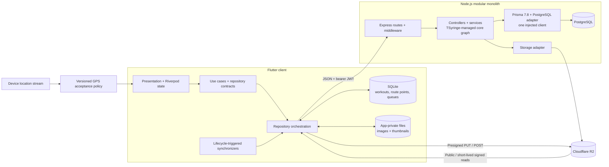
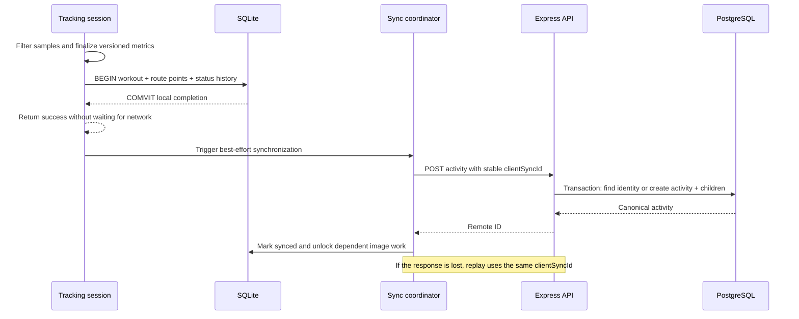

# RythmRun

## Overview

An end-to-end GPS workout system built to explore reliable mobile persistence, retry-safe synchronization, noisy sensor data, and direct object-storage workflows.

RythmRun combines an Android-first Flutter client with a TypeScript modular monolith. Its engineering focus is the work behind the UI: completing a workout without a network, preventing duplicate writes after a lost response, preserving multi-step image operations across restarts, and keeping user-scoped work isolated during account transitions.

> **Project status:** the repository contains production-oriented safeguards and an evidence-driven hardening program; it is not presented as operationally production-ready. Deployment verification, authentication hardening, active-workout recovery, and cross-device restore remain open work. See the [engineering improvement program](docs/_engineering/improvement-plan/README.md).

## Engineering highlights

| Engineering problem | Implementation | Boundary / trade-off |
| --- | --- | --- |
| A workout must not be lost because the API is unavailable | The completed workout, accepted route points, and status history are committed in one SQLite transaction before any network request | Completed workouts are durable; an in-progress workout is still memory-resident and cannot yet recover after process death |
| A timed-out request may already have committed remotely | Every workout carries a stable `clientSyncId`; PostgreSQL enforces uniqueness per user and the API resolves replays inside the creation transaction | Synchronization is queued client-to-server, not bidirectional device restore or conflict resolution |
| Raw GPS samples are noisy and can corrupt metrics | A versioned acceptance policy rejects invalid coordinates, poor accuracy, non-monotonic timestamps, pause-boundary samples, and implausible speeds before distance is accumulated | Conservative thresholds favor metric integrity over retaining every sample |
| Image upload is a multi-step distributed operation | Images are normalized, persisted to app-private storage, recorded in SQLite, uploaded directly to Cloudflare R2, confirmed by the API, and reconciled through an explicit state machine | Work resumes when the app runs again; this is not an OS-scheduled background worker |
| Deleting or replacing media can fail halfway through | Delete tombstones, persisted retry timestamps, stale-operation recovery, idempotent confirmation, and upload-new-before-delete-old semantics preserve intent | Server cleanup currently uses a process-local retry loop rather than a leased job queue |
| Account changes can race queued user-scoped work | Riverpod-wired operation gates drain synchronization, image, and profile work before credentials and providers are cleared | The current isolation work is unit-tested; device and staging verification remain release gates |

Other high-signal details include versioned metric contracts across SQLite and PostgreSQL, SQL-backed history aggregation, server-issued storage keys, signed R2 reads, strict user/avatar DTO allowlists, fail-closed environment validation, and a testable backend bootstrap with no listener side effects.

## Architecture



### Mobile application

The Flutter codebase uses a Clean Architecture-inspired separation:

- `presentation` owns screens, immutable view state, and Riverpod notifiers.
- `domain` defines entities, use cases, and repository contracts.
- `data` coordinates local and remote data sources and maps persistence models.
- `core` contains networking, SQLite, image files, tracking policy, synchronization, configuration, and dependency wiring.

Riverpod is used for both state management and dependency injection. Shared HTTP, database, repository, synchronization, and account-scope services are assembled in one provider graph, while pure tracking components remain independently testable.

Synchronization is intentionally tied to app-observable events: workout completion, session restoration, reconnect, app resume, image mutation, and manual retry. The local database remains authoritative for the completed-workout write path.

### Backend

The backend is a strict-TypeScript Express modular monolith running as native Node.js ESM, with route, middleware, controller, service, DTO, and Prisma boundaries. This keeps transactions and deployment topology simple while the workload does not justify microservices, Kafka, Redis, or Kubernetes.

`createApp` is separate from listener, retry-loop, and signal-handling startup, which keeps imports side-effect-free and HTTP-boundary tests deterministic. Startup validates database, JWT, R2, and browser-edge configuration before infrastructure clients are constructed. Prisma 7.8's `prisma-client` generator writes ESM TypeScript into `src/generated/prisma`; the ordinary TypeScript build emits that client with the application. One `PrismaPg` adapter-backed `PrismaClient` is created for the process, registered once in the TSyringe child container, injected into every database-using service, and disconnected through the server's idempotent shutdown path.

### Data, identity, and storage

- **SQLite** stores workouts, accepted GPS points, status transitions, image state, and remote-deletion tombstones. Schema migrations preserve compatibility through database version 6.
- **PostgreSQL** stores canonical server records and enforces relational ownership, cascading deletion, image identity, avatar intents, and `(userId, clientSyncId)` uniqueness.
- **Cloudflare R2** stores binary media through its S3-compatible API. PostgreSQL stores object identity and lifecycle state rather than blobs; activity reads are short-lived signed URLs while configured public delivery supports the intended public objects.
- **Sessions** use short-lived access JWTs plus rotating refresh JWTs bound to server-side session families. PostgreSQL stores refresh digests rather than raw tokens, protected requests verify active session state, and mobile credential pairs live in a verified secure-storage envelope with bounded offline admission.

There is no AI or LLM integration in the repository. Generated summaries are explicitly deferred rather than represented by unused infrastructure.

## System design

### Completing and synchronizing a workout



The API inserts route points and status events in batches. PostgreSQL provides the final duplicate barrier; the client identity makes a retry safe after the server commits but the response never reaches the phone. A remaining edge case is two simultaneous first-time requests: the constraint prevents duplicate data, but one caller may receive a uniqueness error instead of the winning row.

### Attaching an activity image


The byte upload deliberately disables generic automatic retry. A later attempt reuses the persisted `clientImageId` and server-issued key; an ambiguous PUT may be repeated to that key, while an already-confirmed image is resolved without creating a duplicate record. Delete and replacement use the same durable local state model; replacement uploads the new object before the previous one is queued for deletion.

### Failure semantics

| Operation | Durable intent | Recovery behavior |
| --- | --- | --- |
| Complete workout | SQLite transaction | User completion succeeds locally; outbound push runs when the app has an execution opportunity |
| Create remote workout | Stable `clientSyncId` + database unique constraint | A lost response can be replayed without creating a second activity |
| Delete workout | SQLite tombstone queue | Stepped persisted retry; remote `404` is treated as idempotent success |
| Upload image | App-private files + SQLite state | Conditional state claims, persisted retry time, jitter, and 15-minute stale-operation recovery |
| Replace image | New and old image records | Upload and confirm the new object before queueing deletion of the old object |
| Authorize and confirm avatar | Expiring upload intent in PostgreSQL | Serializable quota allocation; exact key/type/size verification; idempotent confirmation; guarded old-object cleanup |
| Change user scope | Operation leases + generation guards | Drain active user-scoped work before credential removal; invalidate providers before the next session |

## Technical decisions

| Decision | Why it fits this system | Cost accepted |
| --- | --- | --- |
| **Flutter + Riverpod** | One Android-first client codebase, explicit immutable state, and overrideable provider dependencies make sensor, persistence, and session flows testable | Lifecycle and platform-specific background behavior still require native integration |
| **SQLite before network** | Workout completion is a local durability boundary rather than an API availability decision | Schema migrations, queue state, and reconciliation become application responsibilities |
| **Client-generated identities** | Stable IDs separate operation identity from a particular HTTP attempt | The identity contract must be preserved through every persistence and API layer |
| **Versioned GPS and metric contracts** | Historical workouts retain the rules and units used to calculate them while algorithms evolve | Multiple versions must remain readable and tested |
| **Modular monolith + dependency injection** | Transactions remain local, deployment stays simple, and one adapter-backed database client can be replaced at the composition boundary in tests | Process-local timers and a single-process container lifecycle limit horizontal scaling today |
| **R2 object-metadata split** | Large bytes bypass Express and PostgreSQL through the S3-compatible R2 API; the backend retains ownership and lifecycle control | Presigning, confirmation, orphan cleanup, and signed delivery create a multi-step protocol |

The image design explicitly favored R2 object metadata over database blobs or API-proxied uploads. The engineering plan also records a deliberate decision to keep the modular monolith and add distributed infrastructure only when measurements or failure modes justify it.

## Repository structure

```text
.
├── RythmRun_backend_nodejs/
│   ├── prisma.config.ts          # Prisma 7 datasource, migration, and seed configuration
│   ├── prisma/                   # PostgreSQL schema and ordered migrations
│   ├── scripts/                  # Built native-ESM runtime smoke checks
│   └── src/
│       ├── config/               # Environment, DI, and adapter-backed database lifecycle
│       ├── generated/prisma/     # Generated Prisma ESM source (created by prisma generate)
│       ├── routes/               # HTTP surface
│       ├── middleware/           # JWT, validation, security boundaries
│       ├── controllers/          # Transport-to-service adapters
│       ├── services/             # Transactions and domain workflows
│       ├── models/dto/           # Validated request contracts
│       └── __tests__/            # Service and HTTP-boundary tests
├── rythmrun_frontend_flutter/
│   ├── lib/
│   │   ├── core/                 # DI, network, SQLite, tracking, storage
│   │   ├── domain/               # Entities, use cases, repository contracts
│   │   ├── data/                 # Data sources and repository implementations
│   │   └── presentation/         # Riverpod state and Flutter UI
│   └── test/                     # Tracking, persistence, repository, state tests
├── docs/_engineering/
│   └── improvement-plan/         # Risk register, phased plan, evidence logs
└── .github/workflows/            # Backend and Flutter validation workflows
```

## Technology stack

| Responsibility | Technology | Role in the system |
| --- | --- | --- |
| Mobile UI and runtime | Flutter, Dart | Android-first application and lifecycle integration |
| State and dependency graph | Riverpod | View state, service composition, test overrides |
| Location and maps | Geolocator, `flutter_map` | GPS acquisition and route visualization |
| Local persistence | `sqflite`, app-private files | Workout transaction boundary, queues, image durability |
| Networking | Dart `http` | Reused client, environment timeouts, retry policy overrides |
| API | Node.js 22 native ESM, Express, strict TypeScript | Authenticated HTTP boundary and workflow orchestration |
| Backend dependency graph | TSyringe | One process-owned Prisma client plus injectable services and infrastructure adapters |
| Database | PostgreSQL, Prisma 7.8, `@prisma/adapter-pg` | Canonical relational state, migrations, constraints, transactions, and explicit pool lifecycle |
| Binary storage and delivery | Cloudflare R2 | Direct uploads and signed image reads |
| Authentication and validation | Google Sign-In, JWT, bcrypt, Helmet, class-validator | Verified Google identity exchange, first-party sessions, password hashing, headers, DTO allowlists |
| Verification | Flutter Test, native-ESM Jest, TypeScript, Prisma CLI, built-runtime smoke | Unit, repository, HTTP, type, schema, generated-client, and built-artifact checks |

## Performance and reliability

Implemented controls are concrete, but they are not presented as benchmark results or SLOs:

- Completed workout children are batch-inserted within a single local transaction; the backend uses `createMany` inside its activity transaction.
- Local history uses SQL aggregation, 20-item pages, and a lightweight query path that omits route points until details are requested.
- Backend activity pagination is bounded to 50 records per request.
- Images are normalized before upload: maximum 1600-pixel edge, JPEG quality 82, and a 300-pixel thumbnail.
- Image retry schedules and next-attempt times survive restarts; retry delay includes ±20% jitter.
- Direct-to-R2 upload removes image bytes from the API server and database path.
- A reused mobile HTTP client applies 30/15/10-second development/staging/production timeouts and permits risky byte-transfer retries to be disabled.
- Signed image URLs are short-lived and can be refreshed without re-uploading the object.
- Workout deletion hides the record immediately while a durable tombstone completes remote deletion later.

Known performance limits include image transforms on the Flutter UI isolate, eager route-point loading in backend activity responses, offset pagination, missing indexes on several common PostgreSQL access paths, and expensive list copying during long tracking sessions. No load-test baseline or latency SLO is committed yet.

## Security considerations

### Implemented safeguards

- Backend startup fails closed for missing or placeholder database, JWT, or R2 configuration.
- Access and refresh JWT secrets must be distinct, trimmed, and at least 32 characters; passwords are hashed with bcrypt.
- Helmet is enabled globally; authenticated ownership checks protect mutations, while user and avatar writes add strict DTO allowlists, explicit Prisma mappings, and prototype-pollution-aware validation.
- The backend generates user-scoped object keys. AWS credentials are never embedded in the mobile client.
- Avatar presigned policies bind the exact key, MIME type, and byte length; confirmation rechecks object metadata before selection.
- User-facing activity list and detail responses replace stored R2 keys with short-lived signed R2 URLs; upload-protocol responses still return the key needed by the client.
- Avatar cleanup rechecks the currently selected object before deleting an older one.
- Refresh tokens rotate inside bounded session families and are stored only as digests; protected access checks active session state so logout/password revocation does not wait for JWT expiry.
- Flutter stores each access/refresh pair as one verified secure-storage envelope, coordinates refresh through one revision-safe flight, and permits bounded offline access only after server verification.
- Google Sign-In verifies the provider token only on the backend, binds accounts to the stable provider subject, auto-links only an existing password account whose email is already verified, and then uses the same first-party RythmRun session lifecycle.
- Activities default to private, exact activity details are owner-only, and unfinished friend/comment/like routers remain unmounted.
- Browser CORS uses an exact production allowlist; authentication and recovery routes carry endpoint-specific request budgets, typed `429` responses, server-minted request IDs, and privacy-minimized security events.
- The tracked backend and Flutter workflows use read-only GitHub permissions, immutable action SHAs, pinned runners/toolchains, timeouts, non-persisted checkout credentials, and concurrency cancellation.

### Open risks

- SQLite route data and retained activity-photo files are not yet encrypted at rest; IP-2.7 owns the threat model, key design, migration, and performance gate.
- Secure-storage/session behavior is repository-tested but still lacks the MC-2.1 through MC-2.3 hosted PostgreSQL, destructive-cutover, physical-device, backup, clock, and release-log evidence.
- Google identity is repository-delivered, but its non-rolling database migration, real OAuth/signing configuration, provider/device lifecycle, release branding, and optional-iOS policy remain MC-2.4.
- The CORS/rate-limit implementation is repository-tested, but the production origin allowlist, real proxy depth, live `429` recovery, fail-closed boot, and single-replica assumption still require MC-2.6 deployment evidence. Counters are process-local, clear on restart, and do not support horizontal scaling.
- Private-by-default activity behavior still needs its migration applied in staging/production. The policy pages now describe the repository behavior, but IP-5.6 still requires qualified review against a deployed release candidate.
- Authenticated activity create/PATCH routes now have bounded nested validation, capped error output, an explicit 3 MiB parser, and interim per-user/process admission; deployed proxy alignment, resource limits, real PostgreSQL rollback/concurrency, and prior-client compatibility still require MC-1.8 staging proof.
- Activity-image confirmation does not yet verify MIME type and checksum end to end; stale pending server uploads need orphan cleanup.
- Hosted CI, dependency/security scanning, credential rotation evidence, infrastructure policy, backup/restore, and staging verification are not proven by source tests.

These gaps are tracked as release work rather than hidden behind a blanket “secure” or “production-ready” label.

## Verification

Current-tree local verification on **2026-07-27**. Backend dependencies were already installed, so a fresh `npm ci` is not claimed; the Flutter lockfile restore was rerun with enforcement.

| Check | Result |
| --- | --- |
| Backend dependency state | Existing locked installation exercised on the available Node 26.3.0 host; the project targets Node 22.x and hosted CI pins 22.23.1, so run `npm ci --no-audit` on that authoritative toolchain before release |
| Backend Jest suite | 25 executable native-ESM suites and 452 tests passed; the seven-test real-PostgreSQL suite was intentionally skipped locally |
| TypeScript | `npm run typecheck` passed with NodeNext resolution, explicit `.js` specifiers, and generated-client type imports |
| Prisma schema/client | Prisma 7.8 schema validation and generated-client build passed; applying the pending release migrations remains hosted/staging proof |
| Backend build/runtime smoke | The clean production build passed; the emitted runtime started, returned `200` from `/health`, rejected an unauthenticated protected request with `401`, and shut down cleanly |
| Flutter locked restore | `flutter pub get --enforce-lockfile` passed |
| Flutter tests | 355/355 tests passed |
| Flutter analyzer | 0 errors, 0 warnings, and 9 existing informational findings |
| Changed Dart formatting | Both Dart files changed on `feat/api-abuse-controls` passed with zero changes |
| Android package | Not rebuilt for this branch; the earlier debug-package result does not replace physical-device, signed-release, or current release-candidate proof |
| Mobile release identity | `pubspec.yaml` remains `1.1.0+20`; increment the build number before an app-store submission unless the release pipeline supplies a reviewed override |

The repository contains separate stable `Backend security` and `Flutter CI` workflows. The latter pins Flutter 3.44.1/Dart 3.12.1, enforces the lockfile, checks merge-base-changed Dart formatting, rejects warning/error analysis, compares the informational multiset baseline, and runs all Flutter tests. These files and local results are source evidence only: hosted success, independent failure probes, protected CI-control review, and required default-branch checks remain MC-0.7 through MC-0.9 and MC-1.9 through MC-1.11. Local backend verification used Node 26.3.0; the workflow's exact Node 22.23.1 plus PostgreSQL path still needs hosted proof.

## Getting started

### Prerequisites

- Node.js 22.x
- A PostgreSQL database
- Flutter 3.44.1 with Dart 3.12.1 (the repository pin is `.flutter-version`)
- Android SDK and an emulator or device
- Cloudflare R2 configuration; the backend currently validates these at startup even when media flows are not exercised

```bash
git clone https://github.com/cosmicsaurabh/RythmRun.git
cd RythmRun
```

### Backend

```bash
cd RythmRun_backend_nodejs
npm ci --no-audit
cp .env.example .env

# Replace every placeholder before startup.
npm run prisma:generate
npm run prisma:migrate
npm run dev
```

The API listens on port `8080` by default. The development command regenerates and compiles the native-ESM backend before starting it; production startup uses the same built `dist/main.js` entry point. Configuration is grouped by responsibility:

| Responsibility | Variables |
| --- | --- |
| Database | `DATABASE_URL` |
| Google authentication | `GOOGLE_SERVER_CLIENT_ID` |
| JWT | `JWT_SECRET`, `REFRESH_TOKEN_SECRET` |
| R2 account/credentials | `R2_ACCOUNT_ID`, `R2_ACCESS_KEY_ID`, `R2_SECRET_ACCESS_KEY` |
| R2 buckets | `R2_BUCKET_AVATARS`, `R2_BUCKET_ACTIVITY_IMAGES` |
| Browser edge | `CORS_ALLOWED_ORIGINS` (required in production), `TRUST_PROXY_HOPS` |
| Email delivery (optional all-or-none group) | `SMTP_HOST`, `SMTP_USER`, `SMTP_PASS`, `MAIL_FROM`, `PUBLIC_APP_URL`; optional `SMTP_PORT`, `SMTP_SECURE` |
| Runtime | `PORT`, `NODE_ENV` |

Use least-privilege R2 credentials scoped to the reviewed private buckets. The
API issues short-lived presigned URLs for uploads and reads; Flutter does not
need an R2 hostname. The validator rejects documented placeholders, short or
identical JWT secrets, and missing configuration. In production,
`CORS_ALLOWED_ORIGINS` must contain exact HTTPS origins and
`TRUST_PROXY_HOPS` must match the real reverse-proxy depth. Keep exactly one
backend replica while request-budget counters remain process-local.

### Flutter client

Before running, update the development API values in [`app_config.dart`](rythmrun_frontend_flutter/lib/core/config/app_config.dart) for your environment.

```bash
cd rythmrun_frontend_flutter
flutter pub get --enforce-lockfile
flutter run
```

The checked-in development URL is a LAN address and will not work on another machine unchanged. Google sign-in requires the same web OAuth client ID in the backend and Flutter build, and its ID-token exchange refuses cleartext HTTP; use an HTTPS development endpoint or tunnel. Android and iOS OAuth registration, build defines, and the iOS callback scheme are documented in [`CONFIGURATION.md`](rythmrun_frontend_flutter/CONFIGURATION.md#google-sign-in-configuration). Checked-in staging/production API URLs use Render. Media access is authorized by the backend with presigned URLs rather than a Flutter-side R2 origin. Android is the primary exercised target; iOS contains project scaffolding but is not documented as release-ready.

### Run the verification suite

```bash
cd RythmRun_backend_nodejs
npx --no-install prisma validate
npm run typecheck
npm run build
npm run smoke:runtime
npm test -- --runInBand

cd ../rythmrun_frontend_flutter
flutter pub get --enforce-lockfile
flutter test --no-pub
flutter analyze --no-pub --no-fatal-infos
dart analyze --format machine > /tmp/rythmrun-analyzer.machine
dart run tool/ci/analyzer_baseline.dart check \
  --input /tmp/rythmrun-analyzer.machine \
  --baseline tool/ci/analyzer_baseline.json \
  --repository-root .. \
  --package-root .
```

## Future improvements

The next steps are ordered by risk rather than feature visibility:

1. **Close the operational release gate:** verify credential rotation, migrations, hosted CI, storage/CDN policy, staging behavior, backups, rollback, and deployment provenance.
2. **Finish account and privacy hardening:** implement durable account deletion, deploy and verify the private-route and abuse-control slices, enforce storage-boundary upload size/type/integrity and cleanup, obtain qualified review of the updated policy text against the release candidate, and encrypt retained local routes/photos.
3. **Persist active workouts:** checkpoint the tracking timeline and accepted route so process death, reboot, and OS suspension can recover safely; add Android foreground-service behavior where required.
4. **Add server-to-client restore:** introduce cursors, revisions, tombstones, chunked route transfer, and a documented conflict policy before calling synchronization bidirectional.
5. **Externalize asynchronous cleanup:** replace process-local polling with leased durable work, add dependency-aware readiness and bounded graceful shutdown, and expand the current request IDs/security events into release metrics and alerts.
6. **Raise the verification bar:** run the existing PostgreSQL integration suite and full migration chain in required hosted CI, then add device-level offline/restart proof, storage lifecycle tests, load baselines, API contracts, and release/device evidence.

AI summaries, social expansion, microservices, and additional infrastructure remain deliberately out of scope until the core durability, privacy, and operational evidence is complete.

## Engineering lessons

- **Offline behavior is a set of durability boundaries, not a database checkbox.** The system distinguishes local completion, queued push, media confirmation, and cross-device restore instead of treating them as one guarantee.
- **Retries require identity.** A stable operation ID and a database constraint solve the lost-response problem more reliably than retry loops alone.
- **Sensor correctness belongs in one accepted-data pipeline.** Metrics, map rendering, and persisted history should consume the same validated GPS sequence.
- **Object storage needs a lifecycle protocol.** Authorization, upload, confirmation, replacement, deletion, orphan recovery, and signed delivery are separate failure domains.
- **Production readiness is operational evidence.** Passing source tests does not prove deployed secrets, storage policy, migrations, backups, alerts, or rollback behavior.

## Engineering documentation

- [SQLite persistence and queue state](rythmrun_frontend_flutter/lib/core/services/local_db_service.dart)
- [GPS acceptance policy](rythmrun_frontend_flutter/lib/core/tracking/gps_point_acceptance_policy.dart)
- [Activity-image reconciliation](rythmrun_frontend_flutter/lib/data/repositories/activity_image_repository_impl.dart)
- [Retry-safe activity service](RythmRun_backend_nodejs/src/services/activity.service.ts)
- [Avatar intent and cleanup workflow](RythmRun_backend_nodejs/src/services/avatar.service.ts)
- [Prisma 7 adapter and pool lifecycle](RythmRun_backend_nodejs/src/config/database.ts)
- [Built native-ESM runtime smoke](RythmRun_backend_nodejs/scripts/smoke-built-runtime.mjs)
- [Improvement program and architecture decisions](docs/_engineering/improvement-plan/README.md)
- [Program status and audit traceability](docs/_engineering/improvement-plan/STATUS.md)
- [Open manual and hosted verification work](docs/_engineering/improvement-plan/ACTION-REQUIRED.md)
- [PostgreSQL schema](RythmRun_backend_nodejs/prisma/schema.prisma)
- [Backend validation workflow](.github/workflows/backend-security.yml)
- [Flutter validation workflow](.github/workflows/ci.yml)
- [Analyzer baseline gate](rythmrun_frontend_flutter/tool/ci/analyzer_baseline.dart)

The improvement program is intentionally explicit about what code and tests establish, what still requires a real device or infrastructure, and which claims must remain blocked until evidence exists.
