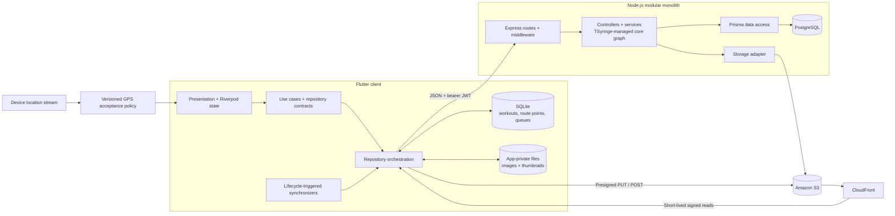
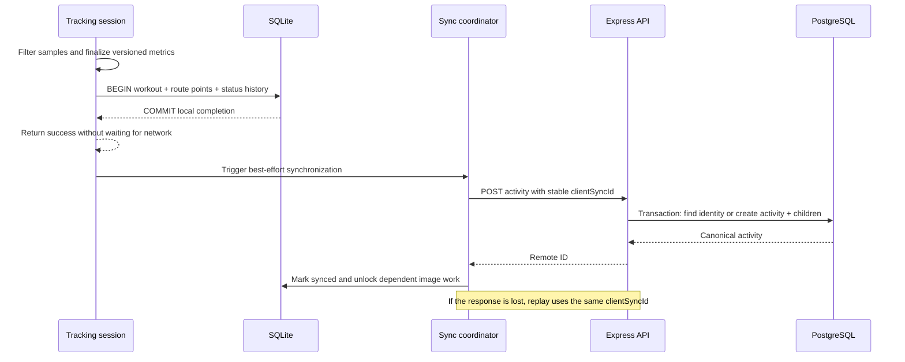
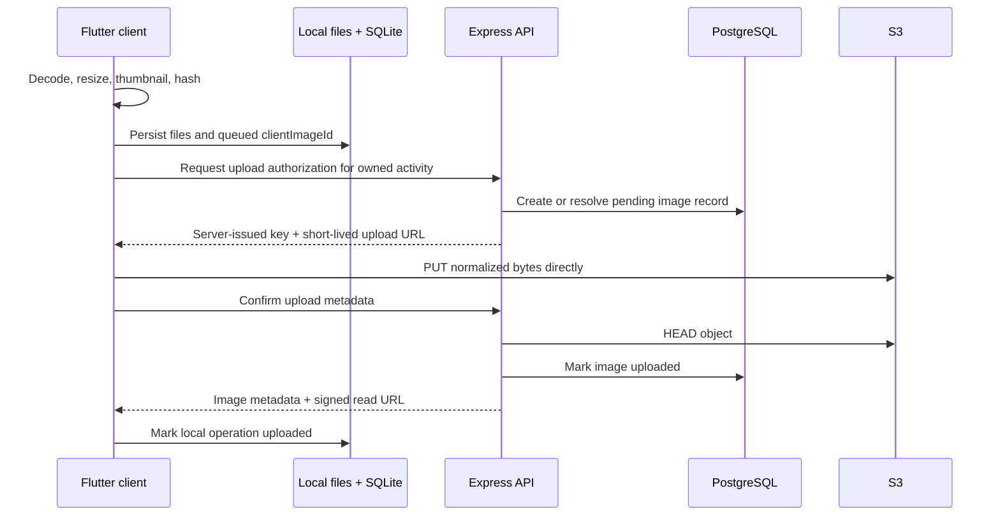

# RythmRun

## Overview

An end-to-end GPS workout system built to explore reliable mobile persistence, retry-safe synchronization, noisy sensor data, and direct object-storage workflows.

RythmRun combines an Android-first Flutter client with a TypeScript modular monolith. Its engineering focus is the work behind the UI: completing a workout without a network, preventing duplicate writes after a lost response, preserving multi-step image operations across restarts, and keeping user-scoped work isolated during account transitions.

> **Project status:** the repository contains production-oriented safeguards and an evidence-driven hardening program; it is not presented as operationally production-ready. Deployment verification, authentication hardening, active-workout recovery, and cross-device restore remain open work. See the [engineering improvement program](docs/_engineering/improvement-plan/README.md).

## Engineering highlights

| Engineering problem | Implementation | Boundary / trade-off |
| --- | --- | --- |
| A workout must not be lost because the API is unavailable | The completed workout, accepted route points, and status history are committed in one SQLite transaction before any network request | Completed workouts are durable; an in-progress workout is still memory-resident and cannot yet recover after process death |
| A timed-out request may already have committed remotely | Every workout carries a stable `clientSyncId`; PostgreSQL enforces uniqueness per user and the API resolves replays inside the creation transaction | Synchronization is queued client-to-server, not bidirectional device restore or conflict resolution |
| Raw GPS samples are noisy and can corrupt metrics | A versioned acceptance policy rejects invalid coordinates, poor accuracy, non-monotonic timestamps, pause-boundary samples, and implausible speeds before distance is accumulated | Conservative thresholds favor metric integrity over retaining every sample |
| Image upload is a multi-step distributed operation | Images are normalized, persisted to app-private storage, recorded in SQLite, uploaded directly to S3, confirmed by the API, and reconciled through an explicit state machine | Work resumes when the app runs again; this is not an OS-scheduled background worker |
| Deleting or replacing media can fail halfway through | Delete tombstones, persisted retry timestamps, stale-operation recovery, idempotent confirmation, and upload-new-before-delete-old semantics preserve intent | Server cleanup currently uses a process-local retry loop rather than a leased job queue |
| Account changes can race queued user-scoped work | Riverpod-wired operation gates drain synchronization, image, and profile work before credentials and providers are cleared | The current isolation work is unit-tested; device and staging verification remain release gates |

Other high-signal details include versioned metric contracts across SQLite and PostgreSQL, SQL-backed history aggregation, server-issued storage keys, signed CloudFront reads, strict user/avatar DTO allowlists, fail-closed environment validation, and a testable backend bootstrap with no listener side effects.

## Architecture



### Mobile application

The Flutter codebase uses a Clean Architecture-inspired separation:

- `presentation` owns screens, immutable view state, and Riverpod notifiers.
- `domain` defines entities, use cases, and repository contracts.
- `data` coordinates local and remote data sources and maps persistence models.
- `core` contains networking, SQLite, image files, tracking policy, synchronization, configuration, and dependency wiring.

Riverpod is used for both state management and dependency injection. Shared HTTP, database, repository, synchronization, and account-scope services are assembled in one provider graph, while pure tracking components remain independently testable.

Synchronization is intentionally tied to app-observable events: workout completion, session restoration, reconnect, app resume, image mutation, and manual retry. The local database remains authoritative for the completed-workout write path.

### Backend

The backend is a strict-TypeScript Express modular monolith with route, middleware, controller, service, DTO, and Prisma boundaries. This keeps transactions and deployment topology simple while the workload does not justify microservices, Kafka, Redis, or Kubernetes.

`createApp` is separate from listener and retry-loop startup, which makes HTTP-boundary tests deterministic. Startup validates database, JWT, AWS, S3, and CloudFront configuration before infrastructure clients are constructed. Core user, activity, image, and avatar services share a TSyringe-managed Prisma client; older social modules have not yet completed that migration and are intentionally not part of the highlighted system.

### Data, identity, and storage

- **SQLite** stores workouts, accepted GPS points, status transitions, image state, and remote-deletion tombstones. Schema migrations preserve compatibility through database version 5.
- **PostgreSQL** stores canonical server records and enforces relational ownership, cascading deletion, image identity, avatar intents, and `(userId, clientSyncId)` uniqueness.
- **S3** stores binary media. PostgreSQL stores object identity and lifecycle state rather than blobs.
- **CloudFront** serves activity images through short-lived signed URLs.
- **JWTs** authenticate API calls. Access and refresh secrets are distinct and validated at startup; the current refresh/session contract still has known gaps documented below.

There is no AI or LLM integration in the repository. Generated summaries are explicitly deferred rather than represented by unused infrastructure.

## System design

### Completing and synchronizing a workout



The API inserts route points and status events in batches. PostgreSQL provides the final duplicate barrier; the client identity makes a retry safe after the server commits but the response never reaches the phone. A remaining edge case is two simultaneous first-time requests: the constraint prevents duplicate data, but one caller may receive a uniqueness error instead of the winning row.

### Attaching an activity image



The byte upload deliberately disables generic automatic retry. A later attempt reuses the persisted `clientImageId` and server-issued key; an ambiguous PUT may be repeated to that key, while an already-confirmed image is resolved without creating a duplicate record. Delete and replacement use the same durable local state model; replacement uploads the new object before the previous one is queued for deletion.

### Failure semantics

| Operation | Durable intent | Recovery behavior |
| --- | --- | --- |
| Complete workout | SQLite transaction | User completion succeeds locally; outbound push runs when the app has an execution opportunity |
| Create remote workout | Stable `clientSyncId` + database unique constraint | A lost response can be replayed without creating a second activity |
| Delete workout | SQLite tombstone queue | Stepped persisted retry; remote `404` is treated as idempotent success |
| Upload image | App-private files + SQLite state | Conditional state claims, persisted retry time, jitter, and 15-minute stale-operation recovery |
| Replace image | New and old image records | Upload and confirm the new object before queueing deletion of the old object |
| Authorize and confirm avatar | Expiring upload intent in PostgreSQL | Serializable quota allocation; exact key/type/size verification; idempotent confirmation; guarded old-object cleanup |
| Change user scope | Operation leases + generation guards | Drain active user-scoped work before credential removal; invalidate providers before the next session |

## Technical decisions

| Decision | Why it fits this system | Cost accepted |
| --- | --- | --- |
| **Flutter + Riverpod** | One Android-first client codebase, explicit immutable state, and overrideable provider dependencies make sensor, persistence, and session flows testable | Lifecycle and platform-specific background behavior still require native integration |
| **SQLite before network** | Workout completion is a local durability boundary rather than an API availability decision | Schema migrations, queue state, and reconciliation become application responsibilities |
| **Client-generated identities** | Stable IDs separate operation identity from a particular HTTP attempt | The identity contract must be preserved through every persistence and API layer |
| **Versioned GPS and metric contracts** | Historical workouts retain the rules and units used to calculate them while algorithms evolve | Multiple versions must remain readable and tested |
| **Modular monolith + dependency injection** | Transactions remain local, deployment stays simple, and infrastructure adapters can be replaced in tests | Process-local timers and partially migrated legacy modules limit horizontal scaling today |
| **S3 metadata split** | Large bytes bypass Express and PostgreSQL; the API retains ownership and lifecycle control | Presigning, confirmation, orphan cleanup, and signed delivery create a multi-step protocol |

The image design explicitly favored S3 metadata over database blobs or API-proxied uploads. The engineering plan also records a deliberate decision to keep the modular monolith and add distributed infrastructure only when measurements or failure modes justify it.

## Repository structure

```text
.
├── RythmRun_backend_nodejs/
│   ├── prisma/                   # PostgreSQL schema and ordered migrations
│   └── src/
│       ├── routes/               # HTTP surface
│       ├── middleware/           # JWT, validation, security boundaries
│       ├── controllers/          # Transport-to-service adapters
│       ├── services/             # Transactions and domain workflows
│       ├── models/dto/           # Validated request contracts
│       └── __tests__/            # Service and HTTP-boundary tests
├── rythmrun_frontend_flutter/
│   ├── lib/
│   │   ├── core/                 # DI, network, SQLite, tracking, storage
│   │   ├── domain/               # Entities, use cases, repository contracts
│   │   ├── data/                 # Data sources and repository implementations
│   │   └── presentation/         # Riverpod state and Flutter UI
│   └── test/                     # Tracking, persistence, repository, state tests
├── docs/_engineering/
│   └── improvement-plan/         # Risk register, phased plan, evidence logs
└── .github/workflows/            # Backend validation workflow
```

## Technology stack

| Responsibility | Technology | Role in the system |
| --- | --- | --- |
| Mobile UI and runtime | Flutter, Dart | Android-first application and lifecycle integration |
| State and dependency graph | Riverpod | View state, service composition, test overrides |
| Location and maps | Geolocator, `flutter_map` | GPS acquisition and route visualization |
| Local persistence | `sqflite`, app-private files | Workout transaction boundary, queues, image durability |
| Networking | Dart `http` | Reused client, environment timeouts, retry policy overrides |
| API | Node.js 22, Express, strict TypeScript | Authenticated HTTP boundary and workflow orchestration |
| Backend dependency graph | TSyringe | Shared infrastructure and injectable core services |
| Database | PostgreSQL, Prisma | Canonical relational state, migrations, constraints, transactions |
| Binary storage and delivery | Amazon S3, CloudFront | Direct uploads and signed image reads |
| Authentication and validation | JWT, bcrypt, Helmet, class-validator | Identity, password hashing, headers, DTO allowlists |
| Verification | Flutter Test, Jest, TypeScript, Prisma CLI | Unit, repository, HTTP, type, and schema checks |

## Performance and reliability

Implemented controls are concrete, but they are not presented as benchmark results or SLOs:

- Completed workout children are batch-inserted within a single local transaction; the backend uses `createMany` inside its activity transaction.
- Local history uses SQL aggregation, 20-item pages, and a lightweight query path that omits route points until details are requested.
- Backend activity pagination is bounded to 50 records per request.
- Images are normalized before upload: maximum 1600-pixel edge, JPEG quality 82, and a 300-pixel thumbnail.
- Image retry schedules and next-attempt times survive restarts; retry delay includes ±20% jitter.
- Direct-to-S3 upload removes image bytes from the API server and database path.
- A reused mobile HTTP client applies 30/15/10-second development/staging/production timeouts and permits risky byte-transfer retries to be disabled.
- Signed image URLs are short-lived and can be refreshed without re-uploading the object.
- Workout deletion hides the record immediately while a durable tombstone completes remote deletion later.

Known performance limits include image transforms on the Flutter UI isolate, eager route-point loading in backend activity responses, offset pagination, missing indexes on several common PostgreSQL access paths, and expensive list copying during long tracking sessions. No load-test baseline or latency SLO is committed yet.

## Security considerations

### Implemented safeguards

- Backend startup fails closed for missing or placeholder database, JWT, AWS, S3, or CloudFront configuration.
- Access and refresh JWT secrets must be distinct, trimmed, and at least 32 characters; passwords are hashed with bcrypt.
- Helmet is enabled globally; authenticated ownership checks protect mutations, while user and avatar writes add strict DTO allowlists, explicit Prisma mappings, and prototype-pollution-aware validation.
- The backend generates user-scoped object keys. AWS credentials are never embedded in the mobile client.
- Avatar presigned policies bind the exact key, MIME type, and byte length; confirmation rechecks object metadata before selection.
- User-facing activity list and detail responses replace stored S3 keys with short-lived signed CloudFront URLs; upload-protocol responses still return the key needed by the client.
- Avatar cleanup rechecks the currently selected object before deleting an older one.
- The tracked backend workflow uses read-only GitHub permissions, immutable action SHAs, timeouts, and concurrency cancellation.

### Open risks

- Mobile tokens currently use `SharedPreferences`; tokens, SQLite route data, and activity files are not encrypted at rest.
- The refresh-token route and mobile response contract are not aligned, registration does not persist its refresh token, and access-token revocation is incomplete.
- Refresh tokens are stored unhashed in PostgreSQL and the model permits only one server-side session per user.
- CORS is currently unrestricted, general API rate limiting is absent, and public activity defaults require a privacy review.
- Nested activity route and status payloads are not recursively validated, and long GPS payloads retain Express's default request-size limit.
- Activity-image confirmation does not yet verify MIME type and checksum end to end; stale pending server uploads need orphan cleanup.
- Hosted CI, dependency/security scanning, credential rotation evidence, infrastructure policy, backup/restore, and staging verification are not proven by source tests.

These gaps are tracked as release work rather than hidden behind a blanket “secure” or “production-ready” label.

## Verification

Local verification on **2026-07-11**:

| Check | Result |
| --- | --- |
| Backend Jest suite | 11 suites, 150 tests passed |
| TypeScript | `npx tsc --noEmit` passed |
| Prisma schema | `npx prisma validate` passed |
| Flutter tests | 130 tests passed |
| Flutter analyzer | 0 errors, 0 warnings; 20 informational lints remain |

The repository contains a backend validation workflow for clean install, Prisma validation/generation, type checking, and Jest. Its presence is source evidence only; successful hosted execution and default-branch protection are still recorded as operational checks.

## Getting started

### Prerequisites

- Node.js 22.x
- A PostgreSQL database
- Flutter with a Dart SDK compatible with `^3.7.0`
- Android SDK and an emulator or device
- S3 and CloudFront signing configuration; the backend currently validates these at startup even when media flows are not exercised

```bash
git clone https://github.com/cosmicsaurabh/RythmRun.git
cd RythmRun
```

### Backend

```bash
cd RythmRun_backend_nodejs
npm ci --no-audit
cp .env.example .env

# Replace every placeholder before startup.
npx prisma generate
npx prisma migrate dev
npm run dev
```

The API listens on port `8080` by default. Required configuration is grouped by responsibility:

| Responsibility | Variables |
| --- | --- |
| Database | `DATABASE_URL` |
| JWT | `JWT_SECRET`, `REFRESH_TOKEN_SECRET` |
| S3 | `AWS_REGION`, `AWS_ACCESS_KEY_ID`, `AWS_SECRET_ACCESS_KEY`, `S3_BUCKET` |
| Signed delivery | `CLOUDFRONT_DOMAIN`, `CLOUDFRONT_KEY_PAIR_ID`, `CLOUDFRONT_PRIVATE_KEY` |
| Runtime | `PORT`, `NODE_ENV` |

Use a least-privilege AWS identity and keep escaped newlines in a one-line `CLOUDFRONT_PRIVATE_KEY`. The validator rejects documented placeholders, short or identical JWT secrets, and malformed configuration.

### Flutter client

Before running, update the development API and CloudFront values in [`app_config.dart`](rythmrun_frontend_flutter/lib/core/config/app_config.dart) for your environment.

```bash
cd rythmrun_frontend_flutter
flutter pub get
flutter run
```

The checked-in development URL is a LAN address and will not work on another machine unchanged. The staging API URL is unset and its CloudFront domain is a placeholder. Android is the primary exercised target; iOS contains project scaffolding but is not documented as release-ready.

### Run the verification suite

```bash
cd RythmRun_backend_nodejs
npm test -- --runInBand
npx tsc --noEmit
npx prisma validate

cd ../rythmrun_frontend_flutter
flutter test
flutter analyze
```

## Future improvements

The next steps are ordered by risk rather than feature visibility:

1. **Close the operational release gate:** verify credential rotation, migrations, hosted CI, storage/CDN policy, staging behavior, backups, rollback, and deployment provenance.
2. **Finish authentication and privacy hardening:** align refresh contracts, move device secrets to protected storage, hash and scope server sessions, add revocation, restrict CORS, rate-limit sensitive routes, and make route privacy explicit.
3. **Persist active workouts:** checkpoint the tracking timeline and accepted route so process death, reboot, and OS suspension can recover safely; add Android foreground-service behavior where required.
4. **Add server-to-client restore:** introduce cursors, revisions, tombstones, chunked route transfer, and a documented conflict policy before calling synchronization bidirectional.
5. **Externalize asynchronous cleanup:** replace process-local polling with leased durable work, readiness checks, graceful shutdown, structured logs, request IDs, metrics, and alerts.
6. **Raise the verification bar:** add PostgreSQL integration and migration tests, device-level offline/restart tests, storage lifecycle tests, load baselines, API contracts, and mobile CI.

AI summaries, social expansion, microservices, and additional infrastructure remain deliberately out of scope until the core durability, privacy, and operational evidence is complete.

## Engineering lessons

- **Offline behavior is a set of durability boundaries, not a database checkbox.** The system distinguishes local completion, queued push, media confirmation, and cross-device restore instead of treating them as one guarantee.
- **Retries require identity.** A stable operation ID and a database constraint solve the lost-response problem more reliably than retry loops alone.
- **Sensor correctness belongs in one accepted-data pipeline.** Metrics, map rendering, and persisted history should consume the same validated GPS sequence.
- **Object storage needs a lifecycle protocol.** Authorization, upload, confirmation, replacement, deletion, orphan recovery, and signed delivery are separate failure domains.
- **Production readiness is operational evidence.** Passing source tests does not prove deployed secrets, storage policy, migrations, backups, alerts, or rollback behavior.

## Engineering documentation

- [SQLite persistence and queue state](rythmrun_frontend_flutter/lib/core/services/local_db_service.dart)
- [GPS acceptance policy](rythmrun_frontend_flutter/lib/core/tracking/gps_point_acceptance_policy.dart)
- [Activity-image reconciliation](rythmrun_frontend_flutter/lib/data/repositories/activity_image_repository_impl.dart)
- [Retry-safe activity service](RythmRun_backend_nodejs/src/services/activity.service.ts)
- [Avatar intent and cleanup workflow](RythmRun_backend_nodejs/src/services/avatar.service.ts)
- [Improvement program and architecture decisions](docs/_engineering/improvement-plan/README.md)
- [Audit traceability: finding → code → test → operational evidence](docs/_engineering/improvement-plan/AUDIT-TRACEABILITY.md)
- [Manual verification register](docs/_engineering/improvement-plan/MANUAL-CHECKS.md)
- [PostgreSQL schema](RythmRun_backend_nodejs/prisma/schema.prisma)
- [Backend validation workflow](.github/workflows/backend-security.yml)

The improvement program is intentionally explicit about what code and tests establish, what still requires a real device or infrastructure, and which claims must remain blocked until evidence exists.
