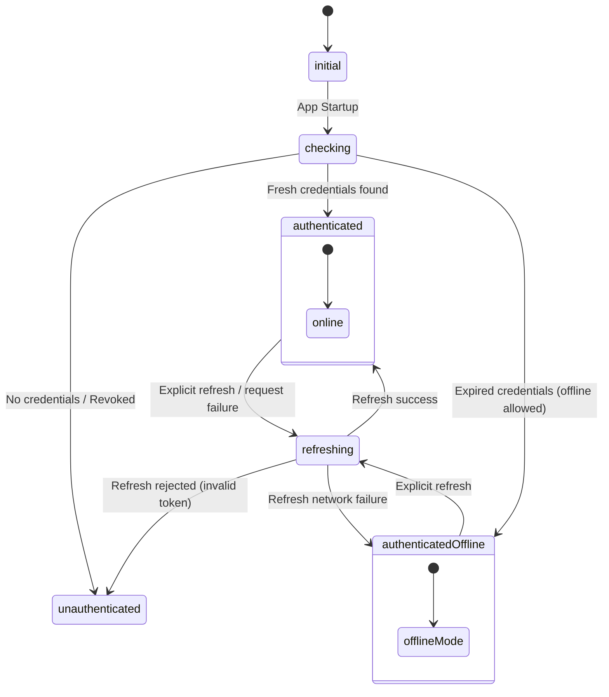
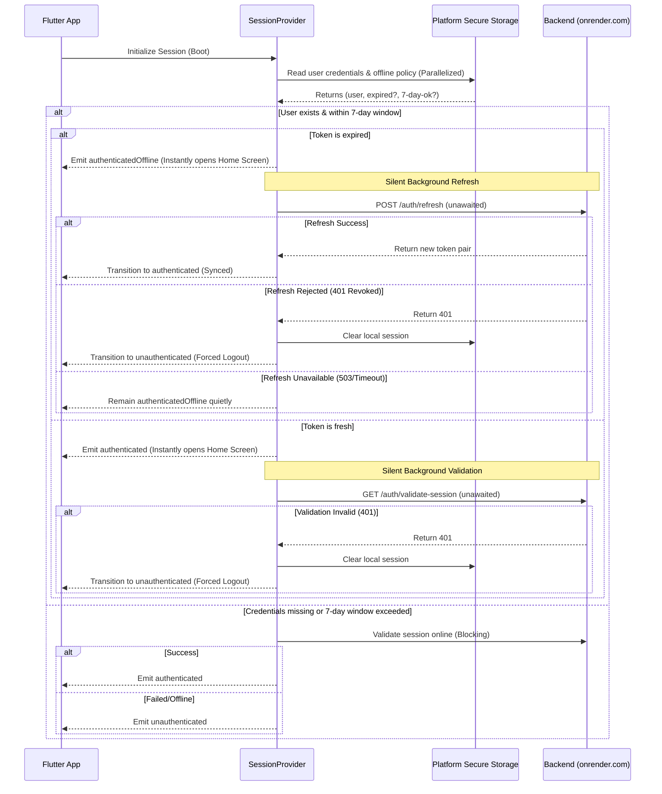

# RythmRun Authentication & Session Architecture

This document provides a high-level overview of the authentication, session state management, and token refresh lifecycle in RythmRun.

---

## Session States

The application's active session is represented by `SessionState` and managed inside [session_provider.dart](file:///Users/saurabhreshape/per-repo/RythmRun/rythmrun_frontend_flutter/lib/presentation/common/providers/session_provider.dart):

- **`initial`**: The default state before any initialization checks have run.
- **`checking`**: The state when the app is executing startup database reads or active online/offline validation checks.
- **`authenticated`**: Full access. The user has valid, fresh credentials and is fully synced with the backend.
- **`authenticatedOffline`**: Bounded offline access. The user is logged in locally, but the app operates in offline-first mode. Direct API mutations and sync are disabled via the `OnlineOperationGuard`.
- **`unauthenticated`**: Guest state. The user must sign in or register to access the app.
- **`refreshing`**: A manual token refresh is in progress.

---

## App Launch Flow (Optimistic Launch)

To achieve a near-instant perceived startup, RythmRun implements an **Optimistic Launch** sequence during initialization:

---

## Token Rotation and Security Seams

1. **Atomic Envelope:** The access token and refresh token are written atomically to secure storage as a single versioned envelope. The envelope's version represents the credential generation.
2. **Single-Flight Refresh:** Token refresh calls are protected by a single-flight mutex (`AuthenticationAttemptGate`). If three requests hit expired tokens at once, only one refresh call is made; the other two wait and replay using the successor token.
3. **Strict Reuse Detection:** Refresh tokens are single-use. If a refresh token is used a second time (e.g., due to replay attacks), the server immediately invalidates the entire session family, logging out all active clients.
4. **Eviction of Failed Flights:** If a token refresh fails, the coordinator evicts the failed flight immediately so that subsequent requests retry cleanly.

---

## Connectivity Classification

When network requests fail, the app differentiates between **device offline** states and **backend service downtime** to avoid misleading user feedback:

- **True Device Offline:** The device is disconnected from Wi-Fi and Cellular networks (or the DNS check to `8.8.8.8` fails).
  - Exception: `AuthSessionUnavailableReason.network`
  - User Messaging: *"The session could not be refreshed while offline."*
- **Backend Service Unavailable:** The device is connected to the internet, but the request to `rythmrun.onrender.com` fails (timeouts, 502 Bad Gateway, or connection refused).
  - Exception: `AuthSessionUnavailableReason.serviceUnavailable`
  - User Messaging: *"The authentication service is temporarily unavailable."*
