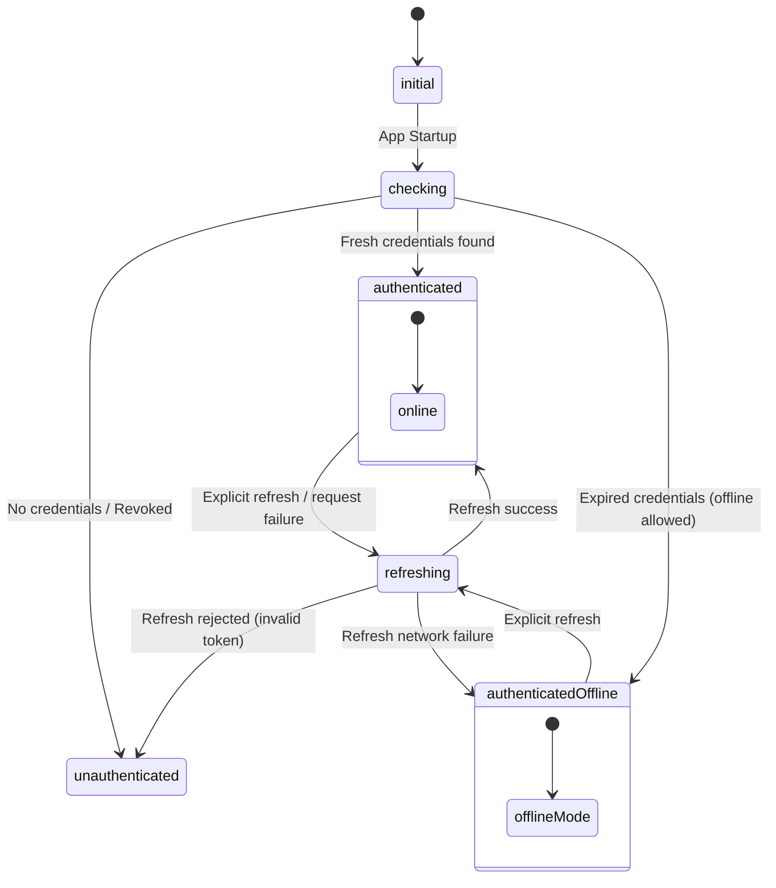
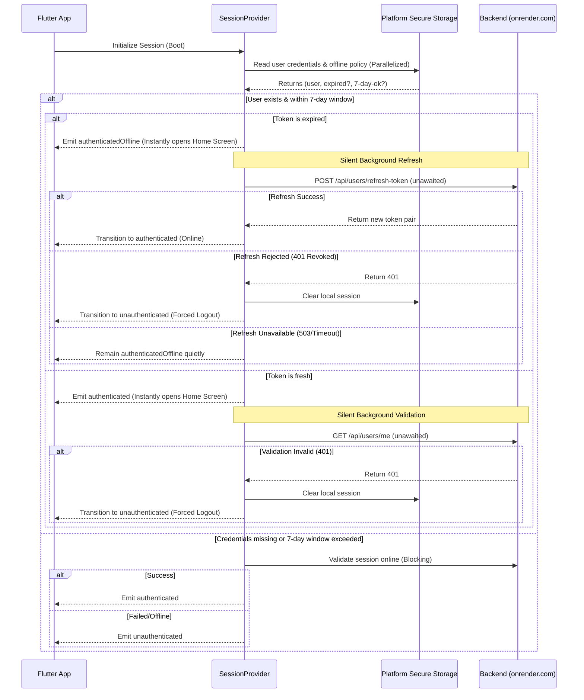

# RythmRun Authentication & Session Architecture

This document provides a high-level overview of the authentication, session state management, and token refresh lifecycle in RythmRun.

---

## Session States

The application's active session is represented by `SessionState` and managed
inside
[`session_provider.dart`](../../../rythmrun_frontend_flutter/lib/presentation/common/providers/session_provider.dart):

```mermaid
stateDiagram-v2
    [*] --> initial
    initial --> checking : App Startup
    checking --> authenticated : Fresh credentials found
    checking --> authenticatedOffline : Expired credentials (offline allowed)
    checking --> unauthenticated : No credentials / Revoked

    state authenticated {
        [*] --> online
    }

    state authenticatedOffline {
        [*] --> offlineMode
    }

    authenticated --> refreshing : Explicit refresh / request failure
    authenticatedOffline --> refreshing : Explicit refresh
    refreshing --> authenticated : Refresh success
    refreshing --> authenticatedOffline : Refresh network failure
    refreshing --> unauthenticated : Refresh rejected (invalid token)
```

- **`initial`**: The default state before any initialization checks have run.
- **`checking`**: The state when the app is executing startup database reads or active online/offline validation checks.
- **`authenticated`**: The user has valid, fresh credentials and can use online
  operations. Workout/image sync may still be queued, restoring, blocked, or
  failed; this state does not mean that data is fully synchronized.
- **`authenticatedOffline`**: Bounded offline access. The user is logged in locally, but the app operates in offline-first mode. Direct API mutations and sync are disabled via the `OnlineOperationGuard`.
- **`unauthenticated`**: Guest state. The user must sign in or register to access the app.
- **`refreshing`**: A manual token refresh is in progress.

---

## App Launch Flow (Optimistic Launch)

To achieve a near-instant perceived startup, RythmRun implements an **Optimistic Launch** sequence during initialization:

```mermaid
sequenceDiagram
    participant App as Flutter App
    participant Provider as SessionProvider
    participant DB as Platform Secure Storage
    participant API as Backend (onrender.com)

    App->>Provider: Initialize Session (Boot)
    Provider->>DB: Read user credentials & offline policy (Parallelized)
    DB-->>Provider: Returns (user, expired?, 7-day-ok?)

    alt User exists & within 7-day window
        alt Token is expired
            Provider-->>App: Emit authenticatedOffline (Instantly opens Home Screen)
            Note over Provider, API: Silent Background Refresh
            Provider->>API: POST /api/users/refresh-token (unawaited)
            alt Refresh Success
                API-->>Provider: Return new token pair
                Provider-->>App: Transition to authenticated (Online)
            else Refresh Rejected (401 Revoked)
                API-->>Provider: Return 401
                Provider->>DB: Clear local session
                Provider-->>App: Transition to unauthenticated (Forced Logout)
            else Refresh Unavailable (503/Timeout)
                Provider-->>App: Remain authenticatedOffline quietly
            end
        else Token is fresh
            Provider-->>App: Emit authenticated (Instantly opens Home Screen)
            Note over Provider, API: Silent Background Validation
            Provider->>API: GET /api/users/me (unawaited)
            alt Validation Invalid (401)
                API-->>Provider: Return 401
                Provider->>DB: Clear local session
                Provider-->>App: Transition to unauthenticated (Forced Logout)
            end
        end
    else Credentials missing or 7-day window exceeded
        Provider->>API: Validate session online (Blocking)
        alt Success
            Provider-->>App: Emit authenticated
        else Failed/Offline
            Provider-->>App: Emit unauthenticated
        end
    end
```

---

## Session exit and retained owner data

Normal logout, account switch, and forced authentication loss quiesce tracking
and drain admitted user work. W1 makes user-state invalidation awaitable:
the workout repository receives the explicit old-owner ID, teardown awaits that
owner's `history_restored=false` write, invalidates the user-scoped providers,
and only then allows credential cleanup to complete. The persistence service
requires `setBool` success and a matching readback; reset failure leaves provider
state and credentials available for recovery. A pending forced-loss marker
reruns the old owner's teardown after restart before credentials are removed. It
does not call `clearLocalWorkouts`, so every owner workout, queued deletion,
point, status, and activity-image row survives normal session exit.

Provider state and local reads/mutations remain user-scoped. Account B cannot
read account A's retained rows, and signing back in as A makes A's rows available
again. The owner-scoped local purge primitive remains intact and reserved for a
future explicit account-deletion path; the current app has no wired in-app
deletion flow. These changes correct the repository portions of D-004,
`SYNC-01`, and `SYNC-09`, while MC-1.6, MC-2.3, and account-deletion E2E still
require external evidence. W1 changes an internal Flutter repository API, not
the backend or server HTTP API.

Retained SQLite data and activity-photo files are still plaintext at rest. The
IP-2.7 encrypted database/file migration, wrapped-key and backup rules,
performance and key-loss behavior, account-deletion E2E, and device proof remain
open.

---

## Bootstrapping History on Login

When a user authenticates and the per-user `history_restored` flag is false, the
`SyncCoordinator` starts a one-shot background bootstrap:

1. It fetches `GET /api/activities?page=N&limit=50` pages. These are full
   activity payloads, including routes; pagination limits row count but does not
   guarantee a small response or prevent a timeout.
2. It inserts only activities not already identified locally by
   `clientSyncId`/remote ID. If the process stops before completion, the flag
   stays false and the next run restarts at page 1; deduplication makes the
   replay idempotent.
3. It sets the flag true only after all pages complete. Normal session exit now
   awaits the old user's reset to false while retaining the owner's local rows,
   so that owner can recheck remote history without losing local-first data.
   The persistence service verifies each boolean write and readback.
4. Flag reads, restore downloads, and the final `history_restored=true` write
   run inside an isolated restore stage. Failure does not report restore
   completion, records the existing internal `SyncProgress.failed` value, and
   continues with owner-checked workout/delete/image push. The current banner
   renders only the restoring state, so failure and manual retry are not yet
   visible UI.
5. `fetchActivities` is a read-only GET under the authenticated request
   coordinator's idempotent replay policy. If its access token expires, one
   successful single-flight refresh may safely replay that GET.
6. `SyncCoordinator` admits one owner-bound flight. A same-owner request that
   arrives while it runs awaits that flight and coalesces into at most one
   bounded follow-up pass. Owner/gate checks between restore, workout push, and
   image push reject stale account completion; workout-only requests use the
   same bounded follow-up rule inside the repository.

This is transitional restore behavior, not full bidirectional sync. It has no
cursor/revision, ongoing pull, remote tombstones, remote-image restore, or
per-item restore isolation. It also has no complete visible sync-state UI or
manual retry. IP-4 owns those remaining corrections.

---

## Token Rotation and Security Seams

1. **Atomic Envelope:** The access token and refresh token are written atomically to secure storage as a single versioned envelope. The envelope's version represents the credential generation.
2. **Single-Flight Refresh:** Token refresh calls are protected by a single-flight mutex (`AuthenticationAttemptGate`). If three requests hit expired tokens at once, only one refresh call is made; the other two wait and replay using the successor token.
3. **Strict Reuse Detection:** Refresh tokens are single-use. If a refresh token is used a second time (e.g., due to replay attacks), the server immediately invalidates the entire session family, logging out all active clients.
4. **Eviction of Failed Flights:** If a token refresh fails, the coordinator evicts the failed flight immediately so that subsequent requests retry cleanly.

---

## Connectivity Classification

`ConnectivityService` now reports only platform network-interface availability.
It performs one initial platform check, follows platform changes, emits the
current value to each subscriber before later changes, and rejects stale events
from a stopped/restarted monitor. It does not poll `8.8.8.8:53`, run a recurring
reachability timer, or claim that an available Wi-Fi/cellular interface proves
internet or backend reachability. The retained `slow` enum value is a
legacy/external state; the platform monitor itself emits connected or
disconnected.

Authentication classification combines that platform fact with the outcome of
the real refresh request:

- **Platform state `disconnected` + `NetworkException`:** return
  `AuthSessionUnavailableReason.network` and show *"The session could not be
  refreshed while offline."* The disconnected state normally means no reported
  interface; an initial platform-check failure also uses this conservative
  state.
- **Interface available + request failure:** return
  `AuthSessionUnavailableReason.serviceUnavailable` and show *"The
  authentication service is temporarily unavailable."* This includes transport
  failures while an interface exists and handled HTTP/service failures; it does
  not assert whether the cause was the backend, a captive portal, or upstream
  connectivity.
