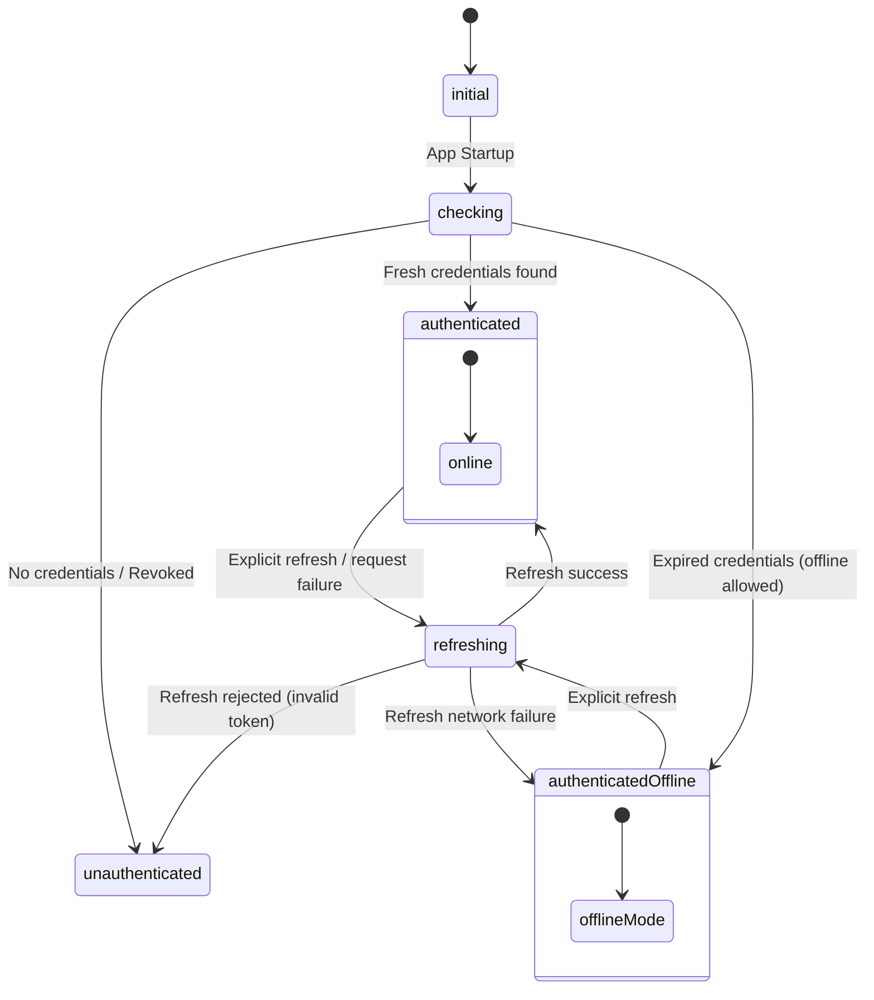
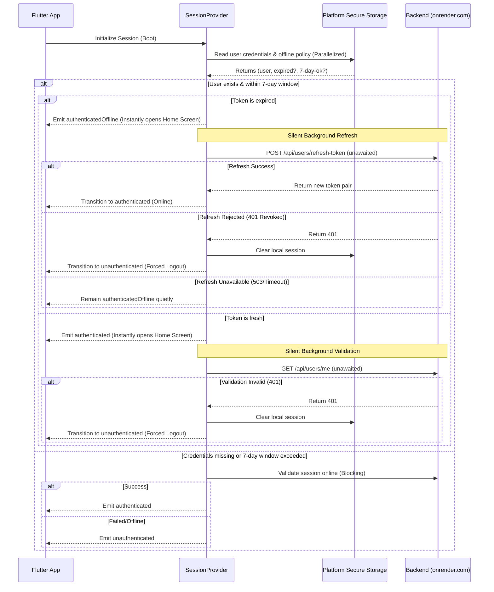

# RythmRun Authentication & Session Architecture

This document provides a high-level overview of the authentication, session state management, and token refresh lifecycle in RythmRun.

---

## Session States

The application's active session is represented by `SessionState` and managed
inside
[`session_provider.dart`](../../../rythmrun_frontend_flutter/lib/presentation/common/providers/session_provider.dart):

```mermaid
stateDiagram-v2
    [*] --> initial
    initial --> checking : App Startup
    checking --> authenticated : Fresh credentials found
    checking --> authenticatedOffline : Expired credentials (offline allowed)
    checking --> unauthenticated : No credentials / Revoked

    state authenticated {
        [*] --> online
    }

    state authenticatedOffline {
        [*] --> offlineMode
    }

    authenticated --> refreshing : Explicit refresh / request failure
    authenticatedOffline --> refreshing : Explicit refresh
    refreshing --> authenticated : Refresh success
    refreshing --> authenticatedOffline : Refresh network failure
    refreshing --> unauthenticated : Refresh rejected (invalid token)
```

- **`initial`**: The default state before any initialization checks have run.
- **`checking`**: The state when the app is executing startup database reads or active online/offline validation checks.
- **`authenticated`**: The user has valid, fresh credentials and can use online
  operations. Workout/image sync may still be queued, restoring, blocked, or
  failed; this state does not mean that data is fully synchronized.
- **`authenticatedOffline`**: Bounded offline access. The user is logged in locally, but the app operates in offline-first mode. Direct API mutations and sync are disabled via the `OnlineOperationGuard`.
- **`unauthenticated`**: Guest state. The user must sign in or register to access the app.
- **`refreshing`**: A manual token refresh is in progress.

---

## App Launch Flow (Optimistic Launch)

To achieve a near-instant perceived startup, RythmRun implements an **Optimistic Launch** sequence during initialization:

```mermaid
sequenceDiagram
    participant App as Flutter App
    participant Provider as SessionProvider
    participant DB as Platform Secure Storage
    participant API as Backend (onrender.com)

    App->>Provider: Initialize Session (Boot)
    Provider->>DB: Read user credentials & offline policy (Parallelized)
    DB-->>Provider: Returns (user, expired?, 7-day-ok?)

    alt User exists & within 7-day window
        alt Token is expired
            Provider-->>App: Emit authenticatedOffline (Instantly opens Home Screen)
            Note over Provider, API: Silent Background Refresh
            Provider->>API: POST /api/users/refresh-token (unawaited)
            alt Refresh Success
                API-->>Provider: Return new token pair
                Provider-->>App: Transition to authenticated (Online)
            else Refresh Rejected (401 Revoked)
                API-->>Provider: Return 401
                Provider->>DB: Clear local session
                Provider-->>App: Transition to unauthenticated (Forced Logout)
            else Refresh Unavailable (503/Timeout)
                Provider-->>App: Remain authenticatedOffline quietly
            end
        else Token is fresh
            Provider-->>App: Emit authenticated (Instantly opens Home Screen)
            Note over Provider, API: Silent Background Validation
            Provider->>API: GET /api/users/me (unawaited)
            alt Validation Invalid (401)
                API-->>Provider: Return 401
                Provider->>DB: Clear local session
                Provider-->>App: Transition to unauthenticated (Forced Logout)
            end
        end
    else Credentials missing or 7-day window exceeded
        Provider->>API: Validate session online (Blocking)
        alt Success
            Provider-->>App: Emit authenticated
        else Failed/Offline
            Provider-->>App: Emit unauthenticated
        end
    end
```

---

## Session exit and retained owner data

Current normal logout, account switch, and forced authentication loss quiesce
tracking and drain admitted user work. Provider invalidation then calls
`clearLocalWorkouts(userId)` and `setHistoryRestored(false)` without awaiting
either future. The purge deletes every owner workout and queued remote deletion;
SQLite cascades remove the related points, status changes, and activity-image
rows.

Provider state and local reads/mutations are user-scoped, so another account
cannot read any surviving rows. That boundary does not make the destructive
normal-session purge safe: it can erase offline work and violates the retained
history rule in D-004. This is an open IP-2.7 / `SYNC-01` defect.

Runbook Step 2 is planned, not implemented. Its target is to retain every owner
row across normal session exit, await the bootstrap-flag reset and provider
invalidation, and reserve destructive purge for explicit account deletion. The
IP-2.7 encrypted database/file migration, backup exclusion, key-loss behavior,
and device proof also remain open.

---

## Bootstrapping History on Login

When a user authenticates and the per-user `history_restored` flag is false, the
`SyncCoordinator` starts a one-shot background bootstrap:

1. It fetches `GET /api/activities?page=N&limit=50` pages. These are full
   activity payloads, including routes; pagination limits row count but does not
   guarantee a small response or prevent a timeout.
2. It inserts only activities not already identified locally by
   `clientSyncId`/remote ID. If the process stops before completion, the flag
   stays false and the next run restarts at page 1; deduplication makes the
   replay idempotent.
3. It sets the flag true only after all pages complete. Current session exit
   fires a reset to false without awaiting it and purges the owner's local rows.
   Step 2 plans to await the reset while retaining those rows, so the same owner
   can recheck remote history without losing local-first data.

This is transitional restore behavior, not full bidirectional sync. It has no
cursor/revision, ongoing pull, remote tombstones, remote-image restore, or
per-item failure isolation, and a restore failure currently prevents push in
the same coordinator pass. IP-4 owns those corrections.

---

## Token Rotation and Security Seams

1. **Atomic Envelope:** The access token and refresh token are written atomically to secure storage as a single versioned envelope. The envelope's version represents the credential generation.
2. **Single-Flight Refresh:** Token refresh calls are protected by a single-flight mutex (`AuthenticationAttemptGate`). If three requests hit expired tokens at once, only one refresh call is made; the other two wait and replay using the successor token.
3. **Strict Reuse Detection:** Refresh tokens are single-use. If a refresh token is used a second time (e.g., due to replay attacks), the server immediately invalidates the entire session family, logging out all active clients.
4. **Eviction of Failed Flights:** If a token refresh fails, the coordinator evicts the failed flight immediately so that subsequent requests retry cleanly.

---

## Connectivity Classification

When network requests fail, the app differentiates between **device offline** states and **backend service downtime** to avoid misleading user feedback:

- **True Device Offline:** The device is disconnected from Wi-Fi and Cellular networks (or the DNS check to `8.8.8.8` fails).
  - Exception: `AuthSessionUnavailableReason.network`
  - User Messaging: *"The session could not be refreshed while offline."*
- **Backend Service Unavailable:** The device is connected to the internet, but the request to `rythmrun.onrender.com` fails (timeouts, 502 Bad Gateway, or connection refused).
  - Exception: `AuthSessionUnavailableReason.serviceUnavailable`
  - User Messaging: *"The authentication service is temporarily unavailable."*
