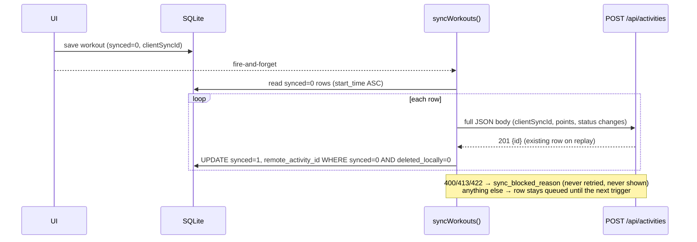
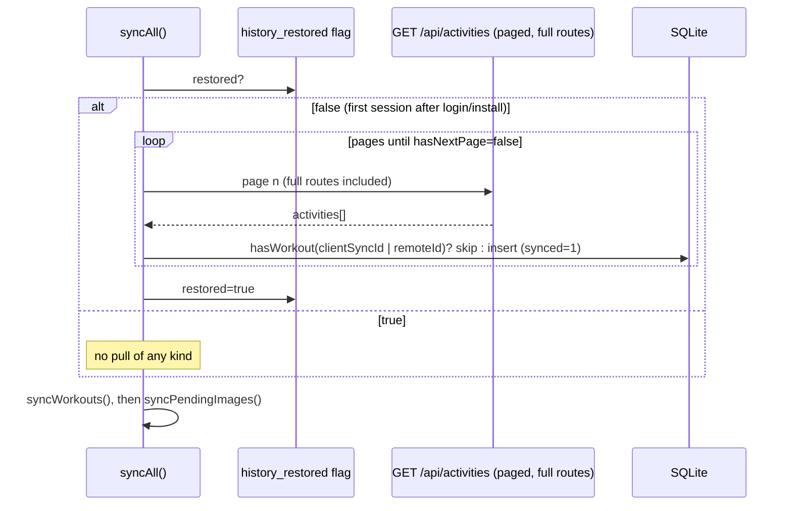

# Push/Pull Sync Reliability Audit

| Field | Value |
| --- | --- |
| Audited | 2026-08-17, branch `auth-impr` at `d0e5b92` (includes the IP-2.7 bootstrap-on-login and clear-on-logout work) |
| Method | Static end-to-end trace of the Flutter client and the Node backend, plus an inventory of the existing automated tests. **No device scenarios were run, no test suite was executed for this audit, and no production data was inspected.** Every claim below cites the code it was read from. |
| Owning phase | [IP-4 Sync, data contracts, restore](../improvement-plan/IP-4-sync-data-restore.md). Findings that belong to another phase say so. |
| Verdict | **NOT READY** for the stated requirement (multi-device consistency). Single-device push and delete are sound in design, with **one P0 data-loss path** (unsynced work is destroyed on session exit). See §8. |

Purpose: a baseline for turning sync work into sprint tickets. §5–§6 separate **Must Fix** from
**Deliberately Not Handling Yet**; §7 is the contract engineers can rely on without re-reading the
implementation. Nothing here changes code; the gap list in §6 is the work.

Requirement being audited against:

> The sync system should reliably keep data consistent across devices under normal real-world
> conditions, including temporary offline periods, retries, reconnections, and multiple devices
> making changes.

---

## 0. What exists today

### 0.1 Components

| Piece | File | Role |
| --- | --- | --- |
| Push/pull orchestration | `rythmrun_frontend_flutter/lib/core/services/sync_coordinator.dart` | `syncAll()`: one-shot restore gate → `syncWorkouts()` → `syncPendingImages()` under a user-scope lease |
| Workout push, delete queue, restore | `rythmrun_frontend_flutter/lib/data/repositories/workout_repository_impl.dart` | `syncWorkouts()` (`:167-241`), `_pushWorkout` (`:243-262`), failure classification (`:264-294`), delete queue (`:296-376`), `downloadAndRestoreWorkouts()` (`:506-546`) |
| Local store (SQLite v6) | `rythmrun_frontend_flutter/lib/core/services/local_db_service.dart` | `workouts` table doubles as the push queue (`synced`, `deleted_locally`, `sync_blocked_reason`, `remote_activity_id`, `client_sync_id`); `workout_delete_queue`; `workout_images` |
| Wire model | `rythmrun_frontend_flutter/lib/data/models/activity_sync_model.dart` | `toJson` for `POST /api/activities`, `fromJson` for `GET /api/activities` |
| HTTP | `rythmrun_frontend_flutter/lib/data/datasources/activity_remote_datasource.dart`, `lib/core/network/http_client.dart`, `lib/core/network/authenticated_request_coordinator.dart` | create (`maxRetries: 2`), delete (`maxRetries: 0`), list (`maxRetries: 2`); transport-only retries; single 401→refresh→replay |
| Triggers | `rythmrun_frontend_flutter/lib/main.dart:56-141` | app resume, session becomes `authenticated`, connectivity `→ connected` |
| Session exit | `rythmrun_frontend_flutter/lib/presentation/common/session/user_scope_teardown.dart`, `lib/presentation/common/providers/user_scope_teardown_provider.dart` | drains sync, then clears the user's local rows and the restore flag |
| Backend activity API | `RythmRun_backend_nodejs/src/services/activity.service.ts`, `src/controllers/activity.controller.ts`, `src/routes/activity.routes.ts` | idempotent create on `(userId, clientSyncId)`, offset-paged list with full routes, hard delete (S3 first), per-user admission guard |
| Backend schema | `RythmRun_backend_nodejs/prisma/schema.prisma:83-169` | `Activity @@unique([userId, clientSyncId])`, `updatedAt @updatedAt`; **no tombstone, no revision, no point sequence** |
| Images | `rythmrun_frontend_flutter/lib/data/repositories/activity_image_repository_impl.dart`, `RythmRun_backend_nodejs/src/services/activity-image.service.ts` | separate durable state machine; idempotent on `(activityId, clientImageId)`; presigned PUT + verified confirm |

### 0.2 Data model that matters for sync

Local `workouts` row (`local_db_service.dart:141-167`):

- `client_sync_id` — client-generated identity, `UNIQUE (user_id, client_sync_id)` (`:1617-1620`). Generated as `rr-<µs timestamp>-<userId>-<16 random hex>` (`lib/core/utils/client_sync_id_generator.dart:8-19`); legacy rows get a deterministic `rr-legacy-…` id.
- `synced` (0/1), `remote_activity_id`, `deleted_locally` (0/1), `sync_blocked_reason` (text or NULL).
- Push queue = `synced = 0 AND deleted_locally = 0 AND sync_blocked_reason IS NULL` (`:420-449`).
- Restored rows are inserted with `synced = 1` because they carry a `remote_activity_id` (`:275`).

Local `workout_delete_queue` (`:1744-1765`): `local_workout_id`, `remote_activity_id UNIQUE`, `user_id`, `status ∈ {queued, retrying, deleting}`, `retry_count`, `next_retry_at`.

Server `Activity` (`schema.prisma:83-112`): scalars + `@@unique([userId, clientSyncId])`, `createdAt`, `updatedAt @updatedAt`. Children `Location`/`StatusChange` cascade; `Location` has **no sequence column** (`:150-161`). Deleting an activity is a hard delete (`activity.service.ts:434-436`); there is no tombstone table.

Restore state: `SharedPreferences` boolean `history_restored_<userId>` (`lib/core/services/auth_persistence_service.dart:364-372`) — set `true` after a full successful bootstrap (`sync_coordinator.dart:56`), set `false` at teardown (`user_scope_teardown_provider.dart:26`). There is no cursor, checkpoint, or timestamp.

### 0.3 When sync runs

| Trigger | Where | What runs |
| --- | --- | --- |
| Session becomes `authenticated` (startup, login, offline→online upgrade) | `main.dart:82-94` | `syncAll()` |
| App resumed | `main.dart:57-61` | `syncAll()` |
| Connectivity transitions **to `connected`** (not to `slow`) | `main.dart:112-141` | `syncAll()` |
| After a workout is saved locally | `workout_repository_impl.dart:72` | `syncWorkouts()` only, fire-and-forget, no online check |
| After a workout is deleted locally | `workout_repository_impl.dart:126` | `syncWorkouts()` only |
| After image attach/delete/replace/retry | `activity_image_repository_impl.dart:91,133,206,249` | `syncPendingImages()` only |
| Periodic timer / pull-to-refresh / "sync now" | — | **none exist** |

`syncAll()` requires `FeatureGate 'sync_workouts'`, i.e. `SessionState.authenticated` (`lib/core/utils/feature_gate.dart:22`), and skips when `OnlineOperationGuard.isOnline` is false — that guard mirrors session state, not connectivity (`session_provider.dart:104`).

### 0.4 Flow at a glance

---

## 1. Flow audit

### 1.1 Push (device → server)

| Check | Finding | Evidence |
| --- | --- | --- |
| How local changes are detected | The `workouts` table is the queue: any row with `synced=0`, not deleted, not blocked. No separate outbox to lose or desynchronise. | `local_db_service.dart:420-449` |
| How they are queued | A completed workout is written to SQLite in one transaction (points and status changes included) before any network I/O. Local-first holds. | `local_db_service.dart:201-311`, `workout_repository_impl.dart:55-80` |
| How they are sent | One `POST /api/activities` per workout with the full route in the body. `Content-Type: application/json`, bearer auth via the coordinator, `maxRetries: 2` at the transport layer. | `activity_remote_datasource.dart:19-48`, `activity_sync_model.dart:9-54` |
| Request failure | Transport failures (socket, TLS, timeout, client) retry inline with 1 s/2 s delays; HTTP errors are thrown immediately. `401 AUTH_ACCESS_INVALID` → one refresh → one replay. Every non-permanent failure leaves the row `synced=0` for the next trigger; the pass **continues to the next row**. | `http_client.dart:92-217`, `authenticated_request_coordinator.dart:58-89`, `workout_repository_impl.dart:264-274` |
| Retry behaviour | No per-row backoff, retry counter, or `nextRetryAt` for pushes; effective retry cadence = trigger cadence (§0.3). Deletes have a bounded ladder (30 s, 2 m, 5 m, 15 m, 1 h, then 6 h). | `workout_repository_impl.dart:369-376` |
| Duplicate requests / retries | Safe. The server keys on `(userId, clientSyncId)`; a replay returns the existing activity (HTTP 201) without creating anything. The DTO requires a non-blank `clientSyncId ≤ 128 chars`. | `activity.service.ts:88-103`, `activity.dto.ts:109-113`, `schema.prisma:111` |
| Server acknowledgement | `data.id` from the 201 body. Recorded locally only via a conditional update (`WHERE id=? AND user_id=? AND client_sync_id=? AND synced=0 AND deleted_locally=0 AND sync_blocked_reason IS NULL`). | `activity_remote_datasource.dart:32-47`, `local_db_service.dart:480-501` |
| When a change counts as synced | Only after that conditional update returns 1. A crash between the server commit and the local update leaves `synced=0`; the next pass replays and the server returns the existing row. | `workout_repository_impl.dart:243-262` |
| Can a failed push lose data? | **Not by the push path itself.** The row survives every failure class. **But see F-01:** the row is deleted by session teardown regardless of sync state. | `local_db_service.dart:1340-1354` |
| Can a change leave the queue before it is safe on the server? | No — the queue is the row, and it only leaves via `recordWorkoutSyncSuccess`, `markWorkoutSyncBlocked` (permanent server rejection — still on disk, just excluded), local delete, or teardown clearing (F-01). | as above |
| Concurrency guards | In-process `_isSyncing` boolean (second caller returns immediately, F-08). Server-side per-user admission guard: a second concurrent mutation for the same user gets `429 ACTIVITY_REQUEST_BUSY` (retryable) — this is what makes a client retry racing its own in-flight request safe in a single-replica deployment. | `workout_repository_impl.dart:168-172`, `activity.routes.ts:12-14, 90-160` |
| Permanent rejections | `400/413/422` (`ACTIVITY_REQUEST_INVALID`, `ACTIVITY_PAYLOAD_INVALID_JSON`, `ACTIVITY_PAYLOAD_TOO_LARGE`, `ACTIVITY_DOMAIN_INVALID`, or `ACTIVITY_HTTP_<status>`) set `sync_blocked_reason` and the row is excluded from the queue forever. There is no UI for it and no unblock path (F-04, F-05). | `workout_repository_impl.dart:15-25, 264-294`, `local_db_service.dart:503-533` |

### 1.2 Pull (server → device)

| Check | Finding | Evidence |
| --- | --- | --- |
| How the client determines what it needs | It does not. The only pull is a **one-shot full bootstrap** after login/install: page through `GET /api/activities?page=n&limit=50` and insert what is missing. After `history_restored_<uid>=true` nothing is ever pulled again until the next logout+login. | `sync_coordinator.dart:52-58`, `workout_repository_impl.dart:506-546` |
| Cursor / version / checkpoint | None. Boolean flag in `SharedPreferences`. Server has `updatedAt` but no endpoint filters on it; there is no revision. | `auth_persistence_service.dart:364-372`, `activity.service.ts:180-233` |
| Can changes be missed? | Yes, by design after bootstrap (everything another device creates or deletes later). During bootstrap: offset pagination ordered by `startTime desc` with no tiebreaker — a delete on another device or equal `startTime` values can shift pages and skip an item (F-15). | `activity.service.ts:187, 206-211` |
| Can changes be received more than once? | Yes across retries and page overlaps; harmless — `hasWorkout` dedups by `clientSyncId`, then by `remoteActivityId`. | `local_db_service.dart:1357-1389` |
| Pull fails halfway | Whole `downloadAndRestoreWorkouts()` throws; already-inserted rows stay; flag stays `false`; the next `syncAll` **restarts from page 1** (idempotent, but re-downloads every page). **And the push phase never runs in that `syncAll`** because restore precedes it and the exception is rethrown (F-03). | `workout_repository_impl.dart:543-545`, `sync_coordinator.dart:51-74` |
| Resume from the correct point | Yes in the sense of correctness (idempotent restart); no in the sense of efficiency (no page/cursor checkpoint). | as above |
| Idempotent apply | Yes. Insert-only, guarded by `hasWorkout`; the local unique index is a second guard. | `local_db_service.dart:231-251` |
| Can an old server change overwrite newer local data? | No. Restore never updates an existing local row; a locally queued row with the same `clientSyncId` is skipped and later pushed (server then returns the existing activity). Workout rows are immutable after completion (the app has no edit path and never calls `PATCH`). | `workout_repository_impl.dart:528-539` |
| Fidelity of what is pulled | `averagePace` is not a server field, so restored rows have `averagePace = null` and display `--:--` (F-10). Optional point fields that were `null` become `0.0`. Images are **not** restored (only `locations`/`statusChanges` are read). | `activity_sync_model.dart:57-114`, `calculation_helper.dart:19-27` |
| Payload bound of a page | None in bytes. Each page carries **full routes** for 50 activities (`activityInclude` = `locations: true`). A modest history (2,000 points/workout ≈ 300 KB) makes a ~15 MB page against a 30 s client timeout, decoded on the UI isolate (F-03). | `activity.service.ts:64-82`, `app_config.dart:69-75` |

### 1.3 Push + pull interaction — traced scenarios

| # | Scenario | Trace | Result |
| --- | --- | --- | --- |
| I-1 | Local change → push → server → pull | Save (`synced=0`) → `POST` → `recordWorkoutSyncSuccess`. Later restore on the same device: `hasWorkout(clientSyncId)` true → skip. | ✅ Correct, no duplicate |
| I-2 | Local change while offline → reconnect → push | Save triggers a `syncWorkouts()` that fails with `NetworkException` (no online gate on that path); row stays queued. Reconnect fires `syncAll` **only if the probe classifies the network as `connected` (< 500 ms socket connect to `8.8.8.8:53`)**; a `slow` recovery does not trigger. App resume does. | ⚠️ Correct eventually; trigger may lag until next resume (F-07) |
| I-3 | Device A creates → Device B pulls | B pulls only at bootstrap. If B is already past bootstrap, B never sees it until B logs out and back in (which also wipes B's local data). | ❌ Not propagated (F-02) |
| I-4 | A and B change the same record | Only possible mutations: delete, and image add/replace/delete. Delete vs delete → second `DELETE` gets 404 → treated as success. Delete vs image add → image upload-url returns 404 (activity gone) → image row `failed`. Image vs image → independent `clientImageId`s, both kept server-side, neither propagated. | ✅ Safe; no conflict resolution needed today (D-01) |
| I-5 | Push while pulling | `saveWorkout` → `syncWorkouts()` can run concurrently with restore (restore does not hold `_isSyncing`). SQLite serialises writes; `hasWorkout` dedups; a workout pushed mid-restore sorts to page 1 (already fetched) so it is not re-fetched. | ✅ Safe |
| I-6 | Retry after the server already processed | Same `clientSyncId` → server returns the existing activity → local marks synced. If the retry overlaps the still-running first request, the admission guard returns `429 ACTIVITY_REQUEST_BUSY` → row stays queued → next pass heals. Across two replicas the second insert would hit `P2002` → 500 → next pass heals (D-03). | ✅ Safe (self-healing) |
| I-7 | Device misses several cycles, catches up | Push: all queued rows are attempted in `start_time ASC` order on the next trigger. Pull: nothing to catch up on — there is no delta pull. | ⚠️ Push yes; pull no (F-02) |
| I-8 | Offline for an extended period, then reconnects | Push side identical to I-7. **But** if the refresh session expired meanwhile (server default `REFRESH_SESSION_TTL_SECONDS = 604800` = 7 days; client offline window also 168 h), the first online validation is `invalid` → `handleForcedAuthenticationLoss()` → teardown → **every unsynced row and queued delete is deleted before it could be pushed.** | ❌ **Data loss (F-01)** |
| I-9 | Network fails halfway through a sync pass | Push: current row stays `synced=0`; the loop keeps trying the remaining rows (each with 3 transport attempts × up to 30 s) while holding the user-scope lease — a logout started meanwhile waits for the drain (F-11). Delete: `deleting` row is reset to `queued` after 15 min (`resetStaleWorkoutDeletes`) or retried on the next pass if it already moved to `retrying`. Restore: see §1.2. | ✅ Correct, ⚠️ slow |
| I-10 | App killed / crashes during sync | Push: no partial state possible (server transaction + local conditional update). Delete: `deleting` lease expires after 15 min then retries; a delete that reached the server returns 404 on retry → success. Restore: idempotent restart from page 1. Images: `uploading`/`deleting` reset after 15 min by the janitor. | ✅ Safe |

---

## 2. Multi-device reliability

| Scenario | Expected | Current behaviour | Verdict |
| --- | --- | --- | --- |
| **A — Sequential** (A changes X, B syncs) | B eventually has X | New workout: B gets it only at B's next bootstrap (logout+login or fresh install). Delete on A: B keeps X indefinitely — restore is insert-only and there are no tombstones; if B later deletes X locally the queued `DELETE` gets 404 and completes cleanly. | ❌ Not met |
| **B — Offline device** (A offline, several changes, reconnects) | All reach the server once, none lost | Push is at-least-once with server idempotency; no duplication. Loss only through F-01 (session exit before push, including the 7-day refresh expiry). Reconnect trigger caveat F-07. | ⚠️ Met, except F-01 |
| **C — Two devices, independent changes** | Both survive and propagate to both | Both reach the server (different `clientSyncId`s; per-user admission guard serialises concurrent POSTs with a retryable 429). Neither device sees the other's change until its next bootstrap. | ❌ Propagation not met |
| **D — Same record on two devices** | Correct or acceptable resolution | Workout rows are immutable after completion (no edit UI; the client never calls `PATCH`). Delete wins over everything; images are independent per `clientImageId`; a photo added on B to a workout A deleted fails permanently on B (`failed`, visible with Retry). No CRDT/OT/locking is required. | ✅ Acceptable (recorded as D-01) |
| **E — Retry / duplicate delivery** | Safe | Create: idempotent by `(userId, clientSyncId)`. Delete: 404 = success on the client. Image upload-url/confirm: idempotent by `(activityId, clientImageId)`. | ✅ Met |
| **F — Interrupted sync** (kill/crash/connectivity loss) | Resume without losing unsynced changes | Push/delete/restore/images all resume safely (§1.3 I-9/I-10). | ✅ Met |

---

## 3. Reliability properties

| Property | Status | Why |
| --- | --- | --- |
| No silent data loss | **Not supported** | Session teardown deletes `synced=0` rows and the delete queue without checking or flushing them (`user_scope_teardown_provider.dart:21-32`, `local_db_service.dart:1340-1354`); reachable by voluntary logout, account switch, and any forced authentication loss including refresh-session expiry after 7 days offline (F-01). Everything else preserves data. |
| No permanently stuck sync queue | **Partially supported** | Retryable rows are re-attempted on every trigger. Rows blocked by 400/413/422 are excluded forever with no retry or visibility (F-04/F-05); a failing restore blocks the whole `syncAll` including push (F-03); `replaceQueued` images can strand (F-13). |
| Safe retries | **Supported** | Server idempotency on `clientSyncId`; conditional local success update; delete 404 = success; image idempotency on `clientImageId`. |
| Idempotent operations where necessary | **Supported** | Create, delete, restore apply, image upload-url/confirm/delete are all idempotent. |
| Duplicate delivery does not corrupt | **Supported** | Replay returns the existing activity; restore dedups by `clientSyncId`/`remoteActivityId`. |
| Correct ordering where it matters | **Supported** | Deletes run before creates in a pass; images wait for their workout's `remoteActivityId` (`waitingForActivitySync`); route points are stored with timestamps and re-sorted on read (no server sequence — acceptable, D-11). |
| Correct checkpoint / cursor advancement | **Not applicable / not supported** | There is no cursor. The only checkpoint is the boolean bootstrap flag, set only after a complete pass; its reset at teardown is un-awaited (F-09). |
| Safe recovery after app restart | **Supported** | Push and restore are idempotent; delete/image leases expire after 15 min. |
| Safe recovery after network failure | **Supported** | Rows remain queued; delete/image ladders back off; restore restarts. |
| Eventual convergence under normal conditions | **Partially supported** | Single device: yes. Across devices: only at bootstrap; no delta pull, no delete propagation, no image propagation (F-02). |
| Multi-device propagation | **Not supported** | See F-02. |
| No older data overwriting newer data | **Supported** | Restore is insert-only; workout rows are immutable; images only refresh remote metadata on existing rows. |

---

## 4. Concrete failure scenarios

Format: **Scenario → Current behaviour → Why it is a problem → Required fix → Priority.** Gap IDs refer to §6.

**F-01 — Session exit destroys unsynced work (P0 — Blocking)**
Scenario: a workout is completed while offline (or its push failed), then the user logs out, switches account, or the app forces sign-out (`SessionValidationStatus.invalid`, refresh reuse detection, or the refresh session simply expired — the server default is 7 days, `env.ts:83`, and the client's own offline window is 168 h, `auth_persistence_service.dart:93-97`). Also: a delete queued locally but not yet sent to the server.
Current behaviour: `teardown()` checks only the in-memory unsaved/active workout (`user_scope_teardown.dart:122-134`), drains in-flight sync, then `_invalidateUserState()` calls `clearLocalWorkouts(userId)` and `setHistoryRestored(false)` **without awaiting either** (`user_scope_teardown_provider.dart:24-31`). `clearUserDataFromLocalDatabase` deletes the user's `workout_delete_queue` rows and **all** `workouts` rows, including `synced=0` (`local_db_service.dart:1340-1354`). Nothing attempts a final push first. On forced loss there are no valid credentials to push with anyway.
Why it is a problem: silent, unrecoverable loss of recorded workouts, and resurrection of locally deleted workouts (the queued remote delete is dropped, so the next bootstrap re-downloads them). "Device offline for an extended period" — literally the primary requirement — ends in data loss whenever the period exceeds the refresh TTL. Priority order #4 in CLAUDE.md ("a workout survives … poor connectivity") is violated.
Required fix: SYNC-01.

**F-02 — No ongoing pull; changes never propagate between devices (P1 — Important)**
Scenario: Device B is past bootstrap; Device A creates or deletes a workout.
Current behaviour: `syncAll` pulls only when `history_restored_<uid>` is false (`sync_coordinator.dart:52-58`); the server has no change/tombstone endpoint (`activity.service.ts:180-233`, `schema.prisma:83-112`). Deletes are hard deletes, so even a full re-listing cannot tell B that X is gone.
Why it is a problem: the stated requirement is multi-device consistency; today the only way to converge is logout+login, which also wipes local data (and, per F-01, unsynced work).
Required fix: SYNC-02 (the one architectural addition this audit recommends), then SYNC-17 for images.

**F-03 — Restore failure blocks push; restore pages are unbounded in bytes (P1)**
Scenario: fresh install for a user with a large history; or the server returns one activity `fromJson` cannot map.
Current behaviour: `syncAll` runs restore first and rethrows on any error, so `syncWorkouts()`/`syncPendingImages()` are skipped in that pass (`sync_coordinator.dart:51-74`). Every retry restarts at page 1 with `limit=50` full-route activities per page (`workout_repository_impl.dart:511-542`; ~15 MB for 2,000-point workouts) against a 30 s timeout with 3 attempts (`http_client.dart:106-108`, `app_config.dart:69-75`). `SyncProgress.failed` is never rendered (`sync_history_banner.dart:11-14`).
Why it is a problem: on that device, push never runs → new workouts never back up; and the user sees nothing. The failure is deterministic for large histories.
Required fix: SYNC-03 (decouple push from restore; skip-and-count un-mappable items; smaller page until IP-4.3 summaries), SYNC-04 (visibility).

**F-04 — Long routes can never sync, silently (P1)**
Scenario: a 60 km+ cycling ride. `distanceFilter: 5` m (`live_tracking_service.dart:68`) → >12,000 points; the client does not cap points; the server rejects `locations` above `MAX_ACTIVITY_LOCATIONS = 12_000` (`activity.dto.ts:42`) with `400 ACTIVITY_REQUEST_INVALID / ACTIVITY_LOCATION_LIMIT_EXCEEDED`.
Current behaviour: 400 is permanent → `sync_blocked_reason` set → excluded from the queue forever (`workout_repository_impl.dart:15-25, 264-294`). No UI, no unblock.
Why it is a problem: cycling is a supported type; the workout looks saved and is never backed up or restored elsewhere.
Required fix: SYNC-04 (visibility + retry) and SYNC-05 (interim bound); the real fix is IP-4.2 batched upload.

**F-05 — No sync visibility at all (P1)**
Scenario: any push failure, blocked row, or restore failure.
Current behaviour: the entity has no sync state; history/detail show none; failures are `debugPrint`/`log` only (`main.dart:75-77`, `workout_repository_impl.dart:72-74, 126-128`); the only banner renders `restoring` (`sync_history_banner.dart:11-14`); no manual retry for workouts; `onRestoreFailed` also fires for push/image failures (`sync_coordinator.dart:71-74`).
Why it is a problem: "completed workouts visibly sync" (CLAUDE.md priority #5) is not met; blocked rows are undiscoverable.
Required fix: SYNC-04.

**F-06 — Delete during an in-flight push orphans the server row (P2 — Future improvement)**
Scenario: user completes a workout and deletes it within the few seconds the `POST` is in flight.
Current behaviour: `deleteWorkoutFromLocalDatabase` hard-deletes rows with `remote_activity_id IS NULL` (`local_db_service.dart:388-395`). The server creates the activity; `recordWorkoutSyncSuccess` updates 0 rows; `_pushWorkout` returns `false` and `syncWorkouts` **returns**, aborting the rest of the pass (`workout_repository_impl.dart:230-231, 256-261`). Nothing enqueues a remote delete.
Why it is a problem: the activity exists only on the server and resurrects on every bootstrap/other device.
Required fix: SYNC-06.

**F-07 — Reconnect only triggers on `→ connected` (P2)**
Current behaviour: `main.dart:119-121` returns unless `nextStatus == connected`; the probe classifies a >500 ms `Socket.connect('8.8.8.8', 53)` as `slow` (`connectivity_service.dart:98-127`), common on cellular. Recovery `disconnected → slow` never syncs; app resume does.
Required fix: SYNC-07 (IP-4.1 item 7 removes the probe later).

**F-08 — A sync requested during a running pass is dropped (P2)**
Current behaviour: `_isSyncing` makes the second `syncWorkouts()` return immediately (`workout_repository_impl.dart:168-172`); a workout saved while a pass is running is not in that pass's row list and waits for the next trigger.
Required fix: SYNC-08.

**F-09 — Bootstrap flag reset is un-awaited and racy (P2)**
Current behaviour: `setHistoryRestored(false)` at teardown resolves `getCurrentUserId()` asynchronously and returns silently if credentials were already cleared (`workout_repository_impl.dart:494-503`); if it loses the race the flag stays `true`, the next login of that user skips restore, and history stays empty until another logout+login.
Required fix: SYNC-09 (moot once SYNC-02 replaces the flag with a cursor pull that runs every session).

**F-10 — Restore fidelity (P2)**
Current behaviour: `fromJson` sets no `averagePace` (server has no such column) → `--:--` in list/detail; `altitude/accuracy/speed/heading` `null → 0.0` (`activity_sync_model.dart:57-70`).
Required fix: SYNC-12.

**F-11 — Push pass keeps going after a transport failure while holding the lease (P2)**
Current behaviour: each remaining row is attempted with 3 transport attempts × up to 30 s; the user-scope lease is held for the whole pass, so `suspendAndDrain` (logout) waits (`workout_repository_impl.dart:203-236, 264-274`; `user_scope_operation_gate.dart:57-74`).
Required fix: SYNC-10.

**F-12 — `images[]` in activity responses is unusable (P2, backend)**
Current behaviour: `addImageUrls` spreads the **Promise** returned by the `async` `getActivityImageReadUrl` (`activity.service.ts:472-484`, `s3.service.ts:97-105`); a spread Promise contributes no fields (`{...Promise.resolve({url})}` → `{}`), so list/detail/create responses carry images with neither `url` nor `s3Key`. The unit test mocks the method synchronously (`activity.service.test.ts:8-11`) and therefore passes. The current client does not read these arrays (it uses `GET /activities/:id/images`), which is why nothing is visibly broken.
Why it is a problem: any image restore (SYNC-17) would build on this response.
Required fix: SYNC-13.

**F-13 — `replaceQueued` image rows can strand (P2)**
Current behaviour: the old row leaves `replaceQueued` only when some image on the same workout reaches `uploaded` (`activity_image_repository_impl.dart:582-587`); if the replacement fails permanently or is deleted first, the old row is never delete-queued, remains visible with Delete only, and its remote object is never removed.
Required fix: SYNC-14.

**F-14 — Delete 404 depends on a message-string match (P2, backend)**
Current behaviour: `deleteActivity` throws a plain `Error('Activity not found or unauthorized')` and the controller maps it to 404 by comparing `error.message` (`activity.service.ts:424-426`, `activity.controller.ts:282-287`). The client's idempotent delete relies on that 404. This is the typed-error rule CLAUDE.md says has already been violated twice; no test covers double-delete.
Required fix: SYNC-15.

**F-15 — Restore pagination is not stable (P2)**
Current behaviour: `orderBy: { startTime: 'desc' }` only, with `skip/take` (`activity.service.ts:187, 206-211`); equal `startTime`s or a concurrent delete shift page boundaries → possible skipped item (duplicates are harmless).
Required fix: SYNC-11 (tiebreaker now); SYNC-02 replaces offset paging.

**F-16 — Concurrent duplicate create across replicas → `P2002` → 500 (P3 — deferred, D-03)**
Single replica + per-user admission guard prevents it today; if it happens, the next pass returns the existing row.

**F-17 — Same `clientSyncId`, different payload → first write wins silently (P3 — deferred, D-02)**
`createActivity` returns the stored row without comparing (`activity.service.ts:101-103`); unreachable in practice with the 128-bit random component.

**F-18 — Restore resurrects a workout deleted locally during the same restore window (P3 — deferred, D-05)**

**F-19 — Local timestamps are stored without a UTC offset (P3 — deferred, D-06)**
`toIso8601String()` of a local `DateTime` has no offset; a device that changes time zone between recording and pushing sends a shifted UTC instant.

**F-20 — Backend delete is S3-first and cleanup is a per-process timer (P3 — deferred, D-07; owned by IP-4.6)**

**F-21 — Delete lease of 15 min delays a crash-interrupted delete retry (P3 — accepted, D-08)**

**F-22 — A response-contract break (missing `data.id`) retries forever (P3 — deferred, D-10)**

Side finding, not sync: teardown never deletes image **files** under `activity_images/<userId>/…` (`activity_image_file_service.dart:183-204`); only rows cascade. This contradicts IP-2.7's "local data clearing" and belongs to IP-2.7, not this audit.

---

## 5. Must Fix vs Deliberately Not Handling Yet

### 5.1 Must Fix (required for "reliable for normal production and multi-device usage")

Ordered by priority; each is a §6 row small enough to be a ticket.

1. **SYNC-01** — never destroy unsynced work at session exit (P0).
2. **SYNC-02** — delta pull with tombstones so devices converge without re-login (P1). This is the one place the audit adds a mechanism rather than patching one, because the current architecture (bootstrap once, hard deletes, no change feed) *cannot* propagate changes.
3. **SYNC-03** — restore must not block push; bound the restore page (P1).
4. **SYNC-04** — visible per-workout sync state, blocked reason, manual retry, rendered failure (P1).
5. **SYNC-05** — interim bound so long routes are not silently unsyncable (P1).
6. **SYNC-16** — tests for the paths that carry the guarantees and currently have none (P1).
7. **SYNC-06 … SYNC-15** — small robustness fixes (P2), each independent.

### 5.2 Deliberately Not Handling Yet (engineering decision log)

| ID | Scenario | Why not now | Assumption the system makes | Consequence if it happens | Revisit when |
| --- | --- | --- | --- | --- | --- |
| D-01 | Concurrent edits to the same workout on two devices (CRDT/OT/locking) | Workout rows are immutable after completion: no edit UI, the client never calls `PATCH`. The only concurrent mutations are delete (delete wins) and images (independent by `clientImageId`). | Nobody edits a completed workout. | None today. | IP-5.7 adds name/notes editing. Then use last-write-wins on server `updatedAt` through the SYNC-02 delta pull; still no CRDT. |
| D-02 | Same `clientSyncId` with a different payload | IDs carry µs timestamp + user + 16 random hex chars; a local unique index prevents same-device duplicates. | Identity collision does not occur. | Server keeps the first payload; the second device marks its row synced against a different activity. | Any observed collision, or a bulk import feature that mints IDs deterministically. |
| D-03 | Two concurrent creates with one `clientSyncId` reach two backend replicas | Single replica; per-user admission guard returns 429 for the second request in-process. `P2002` would surface as 500 and the next pass heals. | One web process (MC-2.6 verifies replica count). | One 500 in logs; no duplicate; delayed sync. | MC-2.6 shows >1 replica → map `P2002` to "re-read and return existing" (S). |
| D-04 | Item skipped by offset shift when another device deletes during a bootstrap | Requires a delete on another device inside a bootstrap window; SYNC-11 removes the tie case. | Bootstrap runs in a quiet moment. | One workout missing on that device until the next full pull. | Superseded by SYNC-02 (cursor). |
| D-05 | Bootstrap re-inserts a workout deleted locally during the same bootstrap | Needs a user delete mid-bootstrap on the same device; user can delete again (404 → clean). | Rare. | One zombie row, user-recoverable. | SYNC-02 tombstones remove it. |
| D-06 | Local-time timestamps without offset drift if the device changes zone before push | Rare; affects `startTime` only. | Recording and pushing happen in the same zone. | Workout shows a shifted start time on other devices. | A user report, or IP-1 formatter work touching timestamp storage. |
| D-07 | S3-before-DB delete ordering; per-process 15-min image cleanup timer | Owned by IP-4.6; needs a durable job table and worker. `deleteObject` on a missing key is a no-op so retries are safe. | Object store is available; one process. | An un-deletable object blocks activity deletion; cleanup backlog after restart. | Object-store outage in production, or the second replica. |
| D-08 | Crash between `markWorkoutDeleteDeleting` and the server call delays retry ≤ 15 min | Trade-off of the stale-lease design; a shorter lease risks double sends (harmless anyway, 404). | 15 minutes is acceptable delete latency. | Delayed remote delete. | Never, unless product wants sub-minute delete propagation. |
| D-09 | Push has no per-row backoff or retry metadata | Retry cadence = trigger cadence (resume/reconnect/save); the server's rate limits and admission guard bound abuse. | Triggers are frequent enough. | Repeated attempts on a dead backend cost battery, not correctness. | 429s from push retries show up in server logs; IP-4.1 adds `nextRetryAt`. |
| D-10 | Backend response contract break (no `data.id`) → infinite retry | Only a deploy bug can cause it; the row is safe. | Contract tests catch it first. | Endless retries, no data loss. | Add a contract test with SYNC-16; classify "unparseable success" as blocked with a reason. |
| D-11 | No server point sequence / revision; ordering by timestamp | Points carry ms timestamps; ties are negligible; needed only for batched v2 upload. | Timestamps are monotone within a workout. | Two points with identical timestamps may swap. | IP-4.2. |
| D-12 | Restore downloads full routes and the entire history on every fresh login (IP-2.7 clears on logout) | IP-4.3 summary/detail projections are the fix; SYNC-03's smaller page is the interim. | Histories are small. | Slow first login; F-03 if it times out. | Measured payload sizes, or any user with a large history. |
| D-13 | `history_restored_<uid>` key left in prefs after server-side account deletion | Harmless boolean. | — | None. | Never. |
| D-14 | Restore does not re-check the current user between pages | The user-scope lease held by `syncAll` prevents account activation until the drain completes; writes stay for the original user. | Gate is honoured by every switch path. | None. | Only if a code path bypasses the gate. |

---

## 6. Implementation gap list

Complexity: S ≤ half a day, M ≤ 2–3 days, L = a sprint. All are **Open** unless noted.

| ID | Area | Problem | Required change | Priority | Complexity | Status |
| --- | --- | --- | --- | --- | --- | --- |
| SYNC-01 | Session exit / local clearing | Teardown deletes `synced=0` rows and the delete queue (F-01) | (a) `clearUserDataFromLocalDatabase` keeps rows with `synced=0` and rows referenced by `workout_delete_queue` (plus their children/images), and keeps the queue; the next login of the same user pushes them (rows are user-scoped, invisible to others). (b) `await` the clear and the flag reset in `invalidateUserState`. (c) On voluntary logout / account switch while online, run a best-effort `syncWorkouts()` **before** `suspendAndDrain` (a teardown callback like `finishWorkout`). Record the privacy trade-off (un-backed-up routes remain on device until pushed) in IP-2.7. | P0 | S (a+b), S (c) | Open |
| SYNC-01b | Session exit UX | User is not told what will happen to unsynced work | If anything remains unsynced after (c): `UserScopeExitRequirement.unsyncedWork` → decision `retrySync` / `logoutAnyway` (rows retained per (a)), reusing the existing exit-resolution dialog | P1 | M | Open |
| SYNC-02 | Pull (backend + client) | No ongoing pull, no delete propagation (F-02) | Backend, additive and backward compatible: `GET /api/activities?updatedAfter=<iso>` ordered `(updatedAt asc, id asc)`; `ActivityTombstone(userId, activityId, clientSyncId, deletedAt)` written in the same transaction as the hard delete, exposed as `?deletedAfter=<iso>` (or one `/api/activities/changes` returning `activities`, `tombstones`, `serverTime`); `createActivity` checks the tombstone for `(userId, clientSyncId)` and returns a typed `ACTIVITY_DELETED` (client: delete wins, drop local row). Client: per-user cursor = last `serverTime` **minus a 5-minute overlap** (idempotent apply makes overlap free and closes the in-flight-commit window); delta pull on every `syncAll` after push; insert-only upsert by `clientSyncId`; apply tombstones only to rows with a matching `remote_activity_id`; complete a queued local delete when its tombstone arrives; advance the cursor only after the page is committed; first run with no cursor = today's bootstrap; drop `history_restored`. Add `case 'ACTIVITY_DELETED'` in `ErrorHandler`. | P1 | L (backend M + client M) | Open |
| SYNC-03 | Restore | Restore failure blocks push; page unbounded (F-03) | In `syncAll`, run restore in its own try/catch and always continue to `syncWorkouts()`; in `downloadAndRestoreWorkouts`, catch per-item mapping errors, skip and count them; `limit: 10` until IP-4.3 summaries; report the failure through `SyncProgress` | P1 | S | Open |
| SYNC-04 | Visibility | No per-workout sync state; blocked rows invisible; failed state unrendered; no manual retry (F-04/F-05) | Expose `synced`/`sync_blocked_reason` on the entity (or a small owner-scoped read); badge in history list + row in detail; "Retry sync" clears `sync_blocked_reason` and calls `syncWorkouts()`; render `SyncProgress.failed`; fire `onRestoreFailed` only for restore. Subset of IP-4.1 item 5 — do not build the full state enum yet. | P1 | M | Open |
| SYNC-05 | Payload bound | Routes > 12,000 points permanently blocked (F-04) | Interim, pick one: raise `MAX_ACTIVITY_LOCATIONS` (and body limit) within a measured bound, **or** thin points client-side before push above the cap (server copy is thinned, local keeps full; note it in the contract). Real fix IP-4.2. | P1 | S | Open |
| SYNC-06 | Push/delete race | Local hard delete during in-flight POST orphans the server row (F-06) | When `recordWorkoutSyncSuccess` returns 0 rows: if the row is absent or `deleted_locally=1` without a queue entry, insert a `workout_delete_queue` row for the returned `remoteActivityId`; continue the pass instead of returning | P2 | S | Open |
| SYNC-07 | Triggers | Reconnect to `slow` never syncs (F-07) | Trigger on `disconnected → anything else` (or treat `slow` as online for sync); IP-4.1 item 7 removes the probe | P2 | S | Open |
| SYNC-08 | Triggers | Sync requested during a running pass is dropped (F-08) | `_syncRequested` flag; after the pass, loop once more if set | P2 | S | Open |
| SYNC-09 | Restore gate | Flag reset un-awaited/racy (F-09) | `await` in teardown and reset before credential clear; retire with SYNC-02 | P2 | S | Open |
| SYNC-10 | Push pass | Keeps trying every row after a transport failure while holding the lease (F-11) | On `NetworkException`, end the pass; keep continuing on HTTP status errors | P2 | S | Open |
| SYNC-11 | Backend list | Unstable page order (F-15) | `orderBy: [{ startTime: 'desc' }, { id: 'desc' }]` | P2 | S | Open |
| SYNC-12 | Restore fidelity | Pace lost; nulls → 0.0 (F-10) | `averagePace = calculatePace(distance, activeDuration)` in `fromJson`; keep optional point fields nullable | P2 | S | Open |
| SYNC-13 | Backend response | `addImageUrls` spreads a Promise (F-12) | Make it `async`, `await Promise.all(...)`; fix the test mock to return a Promise and assert the awaited fields | P2 | S | Open |
| SYNC-14 | Images | `replaceQueued` strands (F-13) | Janitor: `replaceQueued` whose replacement is `failed`/`deleted`/missing → `deleteQueued` | P2 | S | Open |
| SYNC-15 | Backend delete | 404 via message string; untested (F-14) | Throw `ActivityNotFoundError` from `deleteActivity`; route through `sendActivityError`; test double delete → 404 | P2 | S | Open |
| SYNC-16 | Tests | Guarantees without tests (§9) | Add: restore dedup/pagination/mid-page failure/idempotent re-run; `fromJson` round trip; lost-response replay marks synced; delete-queue 404-as-success and backoff schedule; controller-level idempotent `POST`; teardown keeps unsynced rows (after SYNC-01) | P1 | M | Open |
| SYNC-17 | Images (multi-device) | No image restore on other devices | After SYNC-02 and SYNC-13: import remote-only image rows with expiring URLs (IP-4.5 item 7) | P2 | M | Deferred until SYNC-02 |
| SYNC-18 | Docs | Plan/code disagreements (§10) | STATUS.md corrected in this change; IP-4 links this audit; CLAUDE.md/AGENTS.md sentence flagged for the maintainer | P2 | S | Partly done |

---

## 7. Current sync contract (as implemented at `d0e5b92`)

### Guarantees

- **Local-first.** A completed workout is durable in SQLite (workout, points, status changes, one transaction) before any network I/O. The `workouts` table is the push queue; there is no separate outbox that can drift.
- **Push is at-least-once with server-side idempotency.** Identity is `(userId, clientSyncId)`. Any number of retries of the same workout produce exactly one server activity; a lost response is healed by the next attempt. The local row is marked synced only after the server-assigned id is recorded by a conditional update.
- **Failure classification.** Network/timeouts, 401 (one refresh + replay), 403, 429, and 5xx leave the row queued. 400/413/422 mark the row blocked with a stable reason and stop retrying it. Blocked rows stay on the device.
- **Remote deletion is queued durably.** Deleting a synced workout hides it immediately (`deleted_locally=1`), enqueues `(remote_activity_id)`, retries with a 30 s → 6 h ladder, treats 404 as success, and purges the local row only after the server acknowledges. Deleting a never-synced workout removes it locally at once. Interrupted deletes are reclaimed after a 15-minute lease.
- **Fresh-device restore.** After login on a device with no history for that account, the full server history (routes included) is downloaded once, insert-only, idempotent by `clientSyncId` then `remoteActivityId`; a failed restore restarts from the beginning and never duplicates.
- **Account isolation.** Every local read and write is user-scoped; a sync aborts before touching another account's rows; teardown drains in-flight sync before switching.
- **Ordering.** Queued remote deletes run before creates; an image uploads only after its workout has a server id; images are idempotent on `(activityId, clientImageId)` with a verified confirm.
- **Triggers.** Sync runs when the session becomes online, when the app resumes, on connectivity recovery to `connected`, right after a local save/delete (push only), and after image actions.
- **Consistency model.** Single device: eventually consistent with the server for creates and deletes. Across devices: consistent only at bootstrap time.

### Non-guarantees (what the system does not do today)

- **No ongoing pull.** After bootstrap a device never learns about workouts created, deleted, or photographed on another device until it logs out and back in.
- **No delete or image propagation between devices.**
- **Unsynced work does not survive session exit.** Voluntary logout, account switch, and forced authentication loss (including refresh-session expiry, 7 days by default) delete queued workouts and queued deletes on that device. *(P0, SYNC-01.)*
- **No conflict resolution**, because none is needed: workout rows are immutable after completion; delete wins; images are independent.
- **No user-visible sync state**, no manual sync, no manual retry for workouts; blocked rows are invisible.
- **Routes above 12,000 points never sync** (≈ 60 km at the 5 m distance filter).
- **No maximum-offline guarantee** beyond the credential lifetime: after 7 days without a successful refresh the session is forcibly closed (see the P0 above).
- **Restore is not fidelity-perfect**: pace is recomputed as absent (`--:--`), null optional point fields become `0.0`, photos are not restored.
- **The client never updates an activity after creation** (`PATCH` is unused by the app), so server-side edits by any other means are not pulled.
- **Backend replay does not compare payloads**; a reused `clientSyncId` returns the first payload.

---

## 8. Final verdict

### Current status: **NOT READY**

Single-device push and delete are well built — idempotent identities, conditional local acknowledgement, durable delete queue, owner scoping, and safe restart — but the system fails the audited requirement on two counts: it **loses unsynced work at session exit** (P0) and it **cannot propagate changes between devices** (P1). Everything else is small.

**What already works**

- Local-first durability of completed workouts; the workouts table as the queue.
- At-least-once push with server idempotency on `(userId, clientSyncId)`; safe retries, replays, and crash recovery.
- Durable, backoff-driven remote delete with 404-as-success and lease recovery.
- Account-scoped storage and account-switch safety in the push path (well tested).
- One-shot fresh-device restore that is idempotent and never overwrites local rows.
- The image state machine (idempotent upload-url/confirm/delete, verified confirm, stale-lease janitor).

**Critical gaps (P0)**

- SYNC-01: session exit deletes `synced=0` rows and the delete queue; reachable through logout, account switch, forced loss, and refresh expiry after 7 days offline.

**Important gaps (P1)**

- SYNC-02: no delta pull / tombstones — no multi-device convergence.
- SYNC-03: a failing or too-large restore blocks push on that device.
- SYNC-04: no visibility, no retry, blocked rows invisible.
- SYNC-05: routes > 12,000 points are permanently unsyncable.
- SYNC-16: the restore path and the replay loop have no automated tests.

**Deliberately deferred**: D-01 … D-14 in §5.2 — notably no CRDT/OT (rows are immutable), payload-mismatch on identity reuse, cross-replica `P2002`, offset-shift skips, timezone drift, and the IP-4.6 durable-deletion worker.

**Recommended next steps (in order)**

1. Ship SYNC-01 (a)+(b)+(c) — a few hours of work that closes the only data-loss path.
2. Ship SYNC-03, SYNC-10, SYNC-08, SYNC-07 together — small trigger/pass robustness fixes.
3. Ship SYNC-04 + SYNC-05 — make blocked/failed sync visible and stop long rides from being silently unsyncable.
4. Design-review and ship SYNC-02 (backend first, additive; then client), then SYNC-12/13/17 for restore fidelity and photos.
5. SYNC-16 tests land with each of the above; SYNC-06/09/11/14/15 as fillers.

**Before calling the sync system production-reliable**: SYNC-01 through SYNC-05 and SYNC-16 merged with tests, plus a device pass of §2 scenarios A–F on two physical Android devices (one deliberately offline > 7 days) recorded in the IP-4 evidence log. Repository delivery alone does not close this — see the program's evidence rules.

---

## 9. Test coverage baseline (read, not run)

Proven today (file: test names): idempotent create at service level (`activity.service.test.ts` "keeps idempotent create retries ahead of semantic revalidation", "should preserve the existing metric version when clientSyncId already exists"); permanent-rejection blocking and retryable classes (`workout_repository_impl_gate_test.dart` ×9 cases); account-switch safety in the push path (same file + `sync_coordinator_test.dart`); local unique identity and same-id-different-payload rejection (`local_db_service_schema_test.dart`); v6 duplicate quarantine (`local_db_service_migration_test.dart`); owner-scoped delete-queue completion and stale reset at DB level (`local_db_service_ownership_test.dart`); coordinator restore gate and callbacks (`sync_coordinator_test.dart`); image state machine (`activity_image_repository_impl_test.dart`, 20+ cases); outbound `toJson` metrics/UTC contract (`activity_sync_model_test.dart`).

Not proven (no test executes it): `downloadAndRestoreWorkouts` (dedup, pagination, mid-page failure, idempotent re-run) and `ActivitySyncModel.fromJson`; the lost-response replay loop marking `synced=1`; delete-queue 404-as-success and the backoff schedule through `syncWorkouts`; restore-before-push ordering; concurrent-duplicate `P2002` handling; same-id-different-payload server behaviour; controller/route-level idempotent `POST` and double `DELETE`; teardown behaviour with unsynced rows. These are SYNC-16.

Counts at audit time (declarations, not executions): Flutter 345 `test`/`testWidgets` across 53 files; backend 298 `it`/`test` across 27 files. The program's recorded gate numbers live in `STATUS.md`.

## 10. Documentation inconsistencies found

- `STATUS.md` (IP-2.7 row) said app-kill recovery "resumes from where it left off". The code restarts from page 1; `hasWorkout` makes that idempotent. Corrected in this change.
- `CLAUDE.md` / `AGENTS.md` still say completed workouts "are retained per account across logout". Since IP-2.7 (`b9d93de`, `eebe191`) logout clears them. Not edited here — flagged for the maintainer because the sentence also encodes a product decision that SYNC-01 will partially reverse for unsynced rows.
- `IP-4-sync-data-restore.md` audit evidence says "no pull/merge path exists". A bootstrap-only pull now exists; a pointer to this audit was added there.
