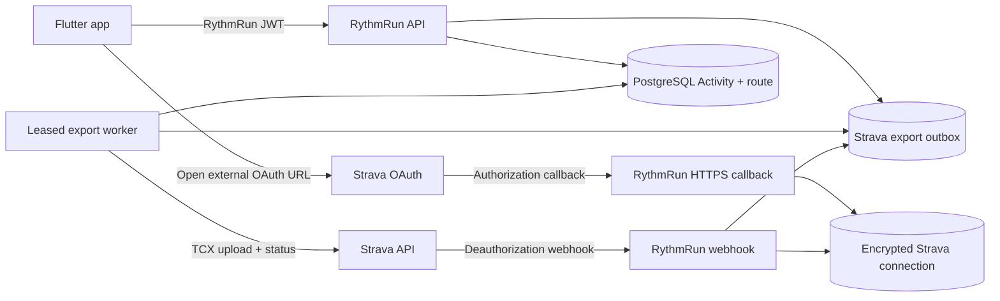
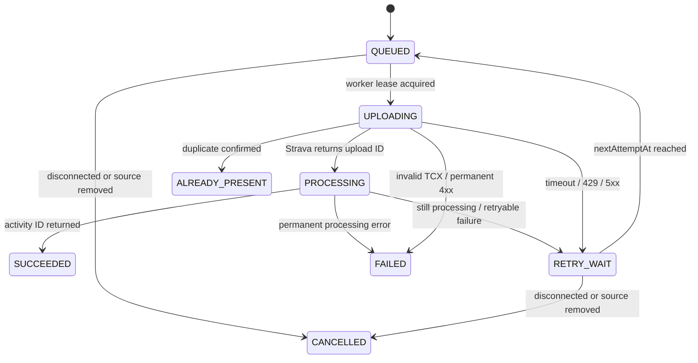

# RythmRun–Strava integration plan

**Status:** Conditional go for one-way export only
**Document date:** 2026-07-16
**Owner:** RythmRun engineering
**Intended audience:** Product, engineering, privacy, security, and release reviewers
**Decision review trigger:** Any change to Strava's API Agreement, API Policy, access tier, OAuth scopes, upload API, or RythmRun's intended integration scope

> This is a technical and product implementation plan, not legal advice. Strava's terms changed materially on June 1, 2026 and may change again. Production use must be reviewed against the then-current terms and, because RythmRun is itself a fitness tracker, should not launch without written confirmation from Strava that the proposed export-only use is permitted.

## Executive decision

RythmRun can technically integrate with Strava. The existing architecture is a strong fit for a backend-owned OAuth connection and a durable activity-export pipeline:

- completed workouts are committed locally before network work;
- every workout has a stable `clientSyncId`;
- the backend already stores the canonical activity, timestamped route, elevation, and pause history;
- PostgreSQL already provides the duplicate barrier for RythmRun activity creation; and
- the Flutter app already has authenticated networking, lifecycle resume handling, settings UI, and retry-aware synchronization.

The recommended product is deliberately narrow:

> A user connects their own Strava account and sends a RythmRun-origin workout to Strava as a route-bearing TCX upload.

The first production version must not import Strava activities, backfill Strava history, show Strava-derived data to other RythmRun users, combine Strava data with RythmRun analytics, use Strava data in advertising or AI, or claim bidirectional synchronization.

The decision is **conditional** because Strava's current terms contain both of these rules:

- applications may offer activity uploads to Strava; and
- applications may not compete with or replicate Strava functionality.

RythmRun's own terms describe a fitness tracking, social sharing, and progress-monitoring application. Written pre-clearance is therefore a launch gate, not an optional administrative step.

Official sources:

- [Strava API Agreement, effective June 1, 2026](https://www.strava.com/legal/api)
- [Strava API Policy, effective June 1, 2026](https://www.strava.com/legal/api_policy)
- [Strava developer documentation](https://developers.strava.com/docs/)

## Relationship to the existing engineering program

This document does not supersede `docs/_engineering/improvement-plan/README.md` or authorize production enablement while its release blockers remain open.

Repository work for a developer-account spike may proceed only when selected by the maintainer. Public beta or production enablement must additionally wait for:

1. the applicable IP-0 security containment and deployment gates;
2. a real server-side account-deletion workflow, including external-provider cleanup;
3. updated privacy and terms documents;
4. working Strava disconnect and deauthorization cleanup;
5. staging and device verification; and
6. Strava approval beyond the available developer capacity.

The current Settings screen presents account deletion but ends with `Account deletion feature coming soon!`. Strava requires a real deletion and withdrawal path before multi-user release.

## Goals

### MVP goals

1. Let an authenticated RythmRun user connect exactly one Strava athlete account.
2. Let the owner manually send a completed RythmRun workout to Strava.
3. Preserve the route, timestamps, distance, active duration, calories when available, altitude samples, and pause boundaries as faithfully as the supported upload format permits.
4. Keep RythmRun workout completion fully local-first and independent of Strava availability.
5. Make every export request retry-safe within RythmRun and resistant to duplicate Strava activities.
6. Show clear export states: not sent, queued, processing, sent, already present, retryable failure, permanent failure, and disconnected.
7. Let the user disconnect, revoke authorization, and remove retained Strava data.
8. Handle external deauthorization through Strava's application webhook.
9. Keep all Strava secrets and athlete tokens out of Flutter and out of logs.
10. Produce the screenshots, privacy behavior, test evidence, and operating controls needed for Strava review.

### Follow-up goal after a successful manual-export pilot

Offer an explicit `Automatically send new workouts` setting. It must default to off, affect only workouts completed after opt-in, and remain backed by the same durable export queue.

## Non-goals

The following are out of scope unless Strava later gives explicit written approval and a separate design is accepted:

- importing or permanently storing Strava workouts;
- historical Strava backfill;
- bidirectional or conflict-resolving sync;
- importing Strava routes, streams, segments, comments, kudos, photos, followers, clubs, gear, or statistics;
- displaying Strava-derived data in RythmRun feeds, profiles, leaderboards, challenges, or friend views;
- using Strava data for RythmRun analytics, product improvement, advertising, recommendations, AI, embeddings, retrieval, or model evaluation;
- changing or deleting a Strava activity when the RythmRun source activity changes or is deleted;
- exporting RythmRun activity images in the first version;
- using Strava as RythmRun sign-in or account identity;
- describing the feature as full `sync` when it is a one-time export snapshot.

## Why export-only is the recommended scope

Strava's June 2026 policy materially constrains data received from the Strava API. Among other restrictions, it requires same-athlete display, limits cached Strava data to seven days, requires prompt reflection of deletion, prohibits aggregated or de-identified analytics, prohibits AI use, and broadly restricts combining Strava data with other customer data.

Those constraints conflict with RythmRun's permanent local history, PostgreSQL activity history, social relationships, activity sharing, and possible future analytics. Import would also require a new bidirectional persistence contract because the current Flutter synchronization path only pushes completed local workouts to RythmRun's backend.

Export-only avoids most of this conflict:

- the workout originates in RythmRun;
- RythmRun remains the source of truth for its own data;
- the Strava API is used only to authorize the user and create the user's Strava copy;
- no Strava activity streams or profile details need to be read back; and
- the general RythmRun social/activity API never needs to expose Strava-derived fields.

Returned upload IDs, Strava activity IDs, athlete IDs, and status text still originate from the API. Before production, confirm with Strava which operational identifiers may be retained and for how long. The implementation should be able to purge remote identifiers after seven days if required while retaining a RythmRun-owned fact such as `export completed at <time>`.

## Current RythmRun fit

### Existing mobile flow

1. Live tracking records accepted GPS points and status changes.
2. Workout completion commits the workout, route points, and status history in one SQLite transaction.
3. The UI treats that local commit as success.
4. `WorkoutRepositoryImpl` asynchronously pushes unsynced workouts to RythmRun's API.
5. A stable `clientSyncId` makes a lost-response retry safe.
6. The local row receives the RythmRun backend activity ID after a successful response.

Relevant files:

- `rythmrun_frontend_flutter/lib/domain/entities/workout_session_entity.dart`
- `rythmrun_frontend_flutter/lib/data/models/activity_sync_model.dart`
- `rythmrun_frontend_flutter/lib/data/repositories/workout_repository_impl.dart`
- `rythmrun_frontend_flutter/lib/core/services/local_db_service.dart`
- `rythmrun_frontend_flutter/lib/core/services/sync_coordinator.dart`

### Existing backend data

The backend `Activity` model already contains:

- type;
- start and end timestamps;
- active duration and paused duration;
- distance;
- average and maximum speed;
- calories;
- name and description;
- elevation gain and loss;
- timestamped latitude, longitude, altitude, accuracy, speed, and heading samples; and
- timestamped active/paused/completed events.

The supported workout types map directly to common Strava sport types:

| RythmRun type | Strava `sport_type` |
| --- | --- |
| `running` | `Run` |
| `walking` | `Walk` |
| `cycling` | `Ride` |
| `hiking` | `Hike` |

Relevant files:

- `RythmRun_backend_nodejs/prisma/schema.prisma`
- `RythmRun_backend_nodejs/src/models/dto/activity.dto.ts`
- `RythmRun_backend_nodejs/src/services/activity.service.ts`

### Existing extension points

- Backend configuration fails closed in `src/config/env.ts`.
- TSyringe registrations live in `src/config/container.ts`.
- HTTP route mounting lives in `src/app.ts`.
- A process timer already triggers durable cleanup retries in `src/server.ts`.
- Flutter endpoint constants live in `lib/core/config/api_endpoints.dart`.
- Flutter providers and repositories are assembled in `lib/core/di/injection_container.dart`.
- Settings can host a new Connected Apps section.
- Workout details can host manual export and status.
- App resume handling can refresh the connection result after browser OAuth.
- User-scope teardown can invalidate Strava state during sign-out or account switch.

## Product behavior

### User journey 1: connect Strava

1. The user opens **Settings → Connected Apps → Strava**.
2. RythmRun shows a pre-consent screen before launching OAuth.
3. The screen lists the information that a future export may send:
   - workout type;
   - title and optionally notes;
   - start/end time and trackpoint timestamps;
   - duration, distance, calories, and elevation samples;
   - latitude/longitude route; and
   - the fact that the activity originated in RythmRun.
4. It explains:
   - nothing is sent merely by connecting;
   - manual export is the MVP default;
   - Strava applies the athlete's Strava privacy defaults;
   - RythmRun's local privacy value does not set Strava visibility;
   - disconnecting stops future exports but does not delete existing Strava activities; and
   - deletion of the RythmRun source does not delete the Strava copy.
5. The user taps the official **Connect with Strava** button.
6. RythmRun opens Strava OAuth in the system browser or Strava app.
7. Strava redirects to an HTTPS RythmRun backend callback.
8. The callback shows a small success, denial, or failure page.
9. When Flutter resumes, it refreshes `GET /api/integrations/strava`.

The HTTPS callback plus refresh-on-resume approach is the recommended MVP because `url_launcher` already exists and the native projects do not currently have a RythmRun inbound-link contract. Universal/app links may be added later to improve the return experience.

### User journey 2: manually send a workout

1. The user opens an owned, completed workout.
2. If the workout has not reached the RythmRun backend, the action shows `Waiting for RythmRun backup` and lets normal sync continue.
3. When a backend activity ID exists, the user taps **Send to Strava**.
4. RythmRun summarizes what will be sent and requires confirmation.
5. Flutter calls the authenticated RythmRun export endpoint.
6. The backend creates or returns the unique export job and responds without waiting for Strava processing.
7. The UI shows `Queued`, then refreshes status using bounded polling while the screen is visible.
8. On success, the UI shows `Sent to Strava` and, when an approved retained activity ID is available, **View on Strava**.
9. On a retryable failure, the UI shows a concise message and **Retry**.
10. On a permanent input failure, the UI explains that the workout could not be exported and does not retry automatically.

### User journey 3: automatic export

This is a post-pilot feature.

1. The user enables **Automatically send new workouts** in the connection screen.
2. The setting explains that only newly completed workouts will be sent.
3. The RythmRun backend, not Flutter, enqueues an export after the canonical Activity transaction commits.
4. The Strava request never occurs inside the Activity database transaction and never delays local workout completion.
5. A durable export row survives server restart and external API failure.
6. The workout detail screen exposes the same status and retry behavior as a manual export.

No historical bulk export should run automatically. If historical export is ever offered, require per-workout selection or a separately reviewed, bounded batch with strong rate control and clear consent.

### User journey 4: disconnect

1. The user opens the Strava connection screen and selects **Disconnect**.
2. RythmRun explains that future exports will stop and existing Strava activities remain on Strava.
3. The backend disables the connection immediately.
4. It calls Strava's recommended OAuth revoke endpoint.
5. After successful revocation, it permanently removes tokens, athlete-linked metadata, pending jobs, and retained Strava identifiers.
6. RythmRun provides confirmation in the UI and through the account's deletion/support channel as required by policy.

If Strava returns a retryable revocation error, the connection becomes `REVOCATION_PENDING`. Its token may be retained encrypted only for bounded revoke retries; it must not be used for exports. The retry record must have an expiry and deletion deadline. This behavior needs privacy/legal approval because it balances immediate local deletion against reliable external revocation.

### User journey 5: external deauthorization

1. The user removes RythmRun from Strava's connected applications.
2. Strava posts an athlete deauthorization webhook.
3. RythmRun acknowledges it within two seconds.
4. Asynchronous processing disables the matching connection, cancels pending exports, and deletes the user's Strava-derived data.
5. The next Flutter status refresh shows `Disconnected`.

## System design



### Design principles

1. **Backend-owned integration:** Flutter never receives the Strava client secret, access token, or refresh token.
2. **Local-first completion:** Strava failure cannot fail or delay workout completion.
3. **Durable intent:** every requested export is stored before external work begins.
4. **Idempotent RythmRun boundary:** one export row per connection and Activity.
5. **Minimal access:** request only the scopes required for export.
6. **No imported activity data:** do not call activity list, detail, stream, stats, social, segment, or route-read endpoints.
7. **Owner-only integration state:** never place Strava IDs or status in general/public Activity responses.
8. **Sanitized observability:** no tokens, authorization codes, raw routes, raw coordinates, athlete profile data, notes, or unbounded provider errors in logs.
9. **Versioned provider adapter:** centralize URLs and response parsing to isolate Strava changes.
10. **Explicit terminology:** user-facing language says `send` or `export`, not two-way `sync`.

## OAuth design

### Scope

Request only:

```text
activity:write
```

`activity:write` permits activity creation and file upload. The user may uncheck a requested scope, so the callback and token response must be checked. A connection without `activity:write` is not usable and must fail safely with a clear explanation.

Strava's documentation says `activity:read` is required for activity webhooks, while its webhook documentation separately describes athlete deauthorization. During the single-player spike, confirm that write-only authorizations receive deauthorization events. If they do not, obtain guidance from Strava before requesting an additional read scope. Do not silently broaden scope merely to simplify implementation.

### OAuth sequence

```mermaid
sequenceDiagram
    participant F as Flutter
    participant R as RythmRun backend
    participant S as Strava

    F->>R: POST /api/integrations/strava/authorize
    R->>R: Generate random state; store digest, user/session, expiry
    R-->>F: authorizeUrl + expiresAt
    F->>S: Open external mobile OAuth URL
    S-->>R: GET callback?code&scope&state
    R->>R: Atomically validate and consume state
    R->>S: Exchange one-time code server-side
    S-->>R: athlete + access/refresh tokens + expiry + scopes
    R->>R: Validate activity:write; encrypt and persist atomically
    R-->>F: Browser success page; app resumes
    F->>R: GET /api/integrations/strava
    R-->>F: Safe connection status only
```

### OAuth state requirements

- at least 128 bits of cryptographically secure randomness;
- persist only a hash/digest, not the presented value;
- bind to the authenticated RythmRun user and preferably the active `AuthSession`;
- expire in approximately ten minutes;
- atomically mark consumed before token exchange;
- reject missing, expired, mismatched, or replayed states;
- do not accept a client-selected callback target;
- allow only a small server-maintained set of post-callback destinations; and
- do not place RythmRun JWTs or Strava tokens in callback URLs.

### Mobile authorization

Use `https://www.strava.com/oauth/mobile/authorize` for the mobile flow. Strava can fall back to the mobile web experience when its app is not installed.

MVP behavior:

- Flutter obtains the complete authorize URL from RythmRun's backend.
- Flutter opens it externally with `url_launcher`.
- The backend receives the registered HTTPS callback.
- Flutter refreshes connection status on resume.

Optional future behavior:

- configure Android App Links and iOS Universal Links;
- have the HTTPS callback redirect to a verified RythmRun app link carrying only a one-time result identifier; and
- retain browser fallback when the app link cannot open.

### Token exchange and refresh

Access tokens currently expire after approximately six hours. Strava may rotate the refresh token on every successful token request, and the older refresh token becomes invalid immediately.

Required refresh algorithm:

1. Begin a connection-scoped database lock or equivalent serialized section.
2. Re-read the connection inside the lock.
3. If another request has already refreshed it and more than one hour remains, use the stored access token.
4. Otherwise decrypt the latest refresh token and call Strava.
5. Validate the response shape and athlete identity.
6. Encrypt and atomically store the new access token, refresh token, expiry, and incremented token revision.
7. Commit before releasing the token to the caller.
8. On invalid-grant/401 failure, disable the connection and require reconnection.

Use a PostgreSQL advisory lock, serializable row update, or another tested per-connection mutex that works across backend processes. A process-local JavaScript mutex is insufficient for multi-instance deployment.

### Token protection

- Prefer a managed KMS/envelope-encryption design in production.
- If application-layer encryption is used, require an authenticated cipher such as AES-256-GCM and unique nonces.
- Store an encryption-key version for rotation.
- Keep the master key in the deployment secret manager, never `.env` in source control.
- Never include tokens in exceptions, structured logs, tracing attributes, analytics, crash reports, or API responses.
- Redact request/response bodies at the Strava client boundary.
- Add tests that scan representative logs and serialized DTOs for token values.

## Proposed backend data model

The exact Prisma syntax should be finalized during implementation. The following is the intended contract.

### `StravaOAuthAttempt`

| Field | Purpose |
| --- | --- |
| `id` | Internal opaque ID |
| `stateDigest` | Unique digest of the presented OAuth state |
| `userId` | RythmRun user initiating the connection |
| `authSessionId` | Optional binding to the active RythmRun session |
| `expiresAt` | Hard expiry |
| `consumedAt` | One-use/replay protection |
| `createdAt` | Audit and cleanup |

Indexes:

- unique `stateDigest`;
- `(userId, createdAt)`; and
- `(expiresAt, consumedAt)` for cleanup.

### `StravaConnection`

| Field | Purpose |
| --- | --- |
| `id` | Internal connection ID |
| `userId` | Unique RythmRun owner |
| `athleteId` | Strava athlete ID stored as a string/64-bit-safe value |
| `status` | `ACTIVE`, `REAUTH_REQUIRED`, `REVOCATION_PENDING`, `DISCONNECTED` |
| `accessTokenCiphertext` | Encrypted access token |
| `accessTokenNonce` | Authenticated-encryption nonce/metadata |
| `refreshTokenCiphertext` | Encrypted refresh token |
| `refreshTokenNonce` | Authenticated-encryption nonce/metadata |
| `tokenKeyVersion` | Encryption rotation support |
| `accessExpiresAt` | Strava access-token expiry |
| `tokenRevision` | Concurrency and audit aid |
| `grantedScopes` | Exact normalized granted scopes |
| `autoExport` | Explicit opt-in; default false |
| `connectedAt` | Connection timestamp |
| `lastRefreshedAt` | Operational status |
| `revocationRequestedAt` | Revocation lifecycle |
| `disconnectedAt` | Cleanup lifecycle |
| `createdAt` / `updatedAt` | Standard timestamps |

Constraints:

- unique `userId`;
- unique active `athleteId`, so one Strava athlete cannot silently connect to multiple RythmRun accounts;
- cascade or explicit cleanup relationship to the RythmRun user; and
- no athlete name, avatar, city, or other profile fields unless a later approved user experience requires them.

### `StravaExport`

| Field | Purpose |
| --- | --- |
| `id` | Internal export ID |
| `connectionId` | Owning Strava connection |
| `activityId` | Canonical RythmRun Activity |
| `externalId` | Deterministic, non-PII provider upload identifier |
| `state` | Durable export state |
| `attemptCount` | Retry accounting |
| `nextAttemptAt` | Persisted backoff |
| `leaseOwner` | Worker claim identity |
| `leaseExpiresAt` | Crash recovery and multi-worker exclusion |
| `stravaUploadId` | Provider upload ID as string, while retention permits |
| `stravaActivityId` | Provider activity ID as string, while retention permits |
| `lastErrorCode` | Bounded internal error category, not raw provider HTML/text |
| `lastAttemptAt` | Operational status |
| `completedAt` | RythmRun-owned completion fact |
| `remoteMetadataPurgeAt` | Enforced retention deadline if required |
| `createdAt` / `updatedAt` | Standard timestamps |

Constraints and indexes:

- unique `(connectionId, activityId)`;
- unique `externalId` within the Strava application;
- `(state, nextAttemptAt)` for worker selection;
- `(leaseExpiresAt, state)` for stale-lease recovery; and
- ownership must be derived through both connection and Activity and validated before work.

### Export state machine



`ALREADY_PRESENT` is terminal. It may not have a reliable Strava activity ID when a duplicate is recognized after an ambiguous request; the UI must not fabricate a View link.

## Proposed RythmRun API

All endpoints except the OAuth callback and webhook require a valid RythmRun access token and active session.

### Get connection

```http
GET /api/integrations/strava
```

Example safe response:

```json
{
  "connected": true,
  "status": "ACTIVE",
  "autoExport": false,
  "grantedScopes": ["activity:write"],
  "connectedAt": "2026-07-16T10:00:00.000Z"
}
```

Do not return the athlete ID, tokens, provider error bodies, or athlete profile fields unless a later approved UI requires them.

### Begin authorization

```http
POST /api/integrations/strava/authorize
```

Response:

```json
{
  "authorizeUrl": "https://www.strava.com/oauth/mobile/authorize?...",
  "expiresAt": "2026-07-16T10:10:00.000Z"
}
```

This endpoint must reject offline mode at the Flutter data layer and reject a suspended user scope.

### OAuth callback

```http
GET /api/integrations/strava/callback?code=...&scope=...&state=...
```

This is a browser endpoint, not a JSON endpoint for Flutter. It must:

- apply strict query limits;
- validate and consume state;
- handle `error=access_denied`;
- exchange the code server-side;
- validate the granted scope;
- prevent cross-account athlete linking;
- avoid exposing sensitive failure detail; and
- return an accessible success/failure HTML page with no third-party scripts or analytics.

### Update connection settings

```http
PATCH /api/integrations/strava
Content-Type: application/json

{
  "autoExport": true
}
```

Only an allowlisted boolean field is accepted. Enabling auto-export requires an active connection and an explicit, recent user action.

### Disconnect

```http
DELETE /api/integrations/strava
```

Return `204` after confirmed revoke and cleanup. If revocation is safely queued because Strava is unavailable, return `202` with a non-sensitive `REVOCATION_PENDING` status and provide eventual confirmation.

### Request or resolve export

```http
POST /api/activities/{activityId}/integrations/strava/export
```

Behavior:

- verify Activity ownership, not merely visibility;
- require a completed Activity and active connection;
- create the unique export row or return the existing row;
- return `202` for queued/processing work;
- return `200` for an existing terminal result;
- never block while Strava finishes processing; and
- never create a second export row because the user double-tapped.

Example response:

```json
{
  "state": "QUEUED",
  "requestedAt": "2026-07-16T10:15:00.000Z",
  "retryable": false,
  "viewUrl": null
}
```

### Get export state

```http
GET /api/activities/{activityId}/integrations/strava/export
```

Example terminal response:

```json
{
  "state": "SUCCEEDED",
  "completedAt": "2026-07-16T10:15:06.000Z",
  "retryable": false,
  "viewUrl": "https://www.strava.com/activities/123456789"
}
```

Only return `viewUrl` when retaining and displaying the returned activity ID is approved. The link text in Flutter must be exactly **View on Strava**.

### Retry export

```http
POST /api/activities/{activityId}/integrations/strava/export/retry
```

Allow retry only for a terminal retryable state, or make the primary POST perform this transition idempotently. Do not let the client control attempt count, provider ID, next-attempt time, or external ID.

### Webhook verification and events

```http
GET  /api/integrations/strava/webhook
POST /api/integrations/strava/webhook
```

The GET verifies `hub.verify_token` and echoes `hub.challenge` as documented by Strava. The POST validates the bounded event schema, acknowledges within two seconds, and persists only the minimal work required for asynchronous handling.

## TCX export design

### Format decision

Use TCX v2 for the production spike and MVP.

Why TCX:

- it carries timestamped trackpoints and route coordinates;
- it carries altitude samples;
- its Lap fields carry total time, distance, and calories;
- separate Track elements can represent pause/resume intervals;
- Strava recognizes running, biking, hiking, and walking from TCX; and
- it is simpler to generate correctly than FIT for the data RythmRun currently records.

Why not a manual activity:

- it does not preserve the route;
- it lacks an `external_id` upload field;
- an ambiguous response is therefore harder to deduplicate; and
- it discards the strongest value of the RythmRun recording.

Why not GPX as the primary format:

- GPX is a good route interchange format but its base format does not carry distance or calories as directly as TCX;
- RythmRun has useful lap-level summary data already; and
- TCX provides a cleaner pause-segmentation model for this use case.

Why not FIT initially:

- RythmRun does not currently record heart rate, cadence, power, or registered device/manufacturer metadata;
- FIT generation adds binary-format and SDK complexity without enough MVP value; and
- TCX covers all current workout types and source fields.

### Field mapping

| RythmRun source | TCX / upload destination | Notes |
| --- | --- | --- |
| `Activity.type` | upload `sport_type` and TCX Activity sport | Map through an exhaustive enum function |
| `Activity.name` | multipart `name` | Fallback such as `Morning Run` should be deterministic and non-sensitive |
| `Activity.description` | multipart `description` | User-controlled option; disclose that notes may contain sensitive text |
| `Activity.startTime` | Activity ID / Lap `StartTime` | Serialize in UTC with `Z` |
| `Activity.duration` | Lap `TotalTimeSeconds` | Active duration, excluding normalized pauses |
| `Activity.distance` | Lap `DistanceMeters` | Strava may recalculate |
| `Activity.calories` | Lap `Calories` | Omit when absent; current RythmRun estimate may differ from Strava |
| `Location.timestamp` | Trackpoint `Time` | Strictly increasing after validation |
| `Location.latitude` | Position `LatitudeDegrees` | Validate bounds |
| `Location.longitude` | Position `LongitudeDegrees` | Validate bounds |
| `Location.altitude` | `AltitudeMeters` | Omit when absent/invalid |
| `StatusChange` history | Multiple Track elements | Include points only in active intervals |
| `Activity.clientSyncId` | upload `external_id` input | Hash or namespace to avoid exposing internal structure |
| RythmRun app identity | TCX Creator name | Use truthful `RythmRun`; do not claim a barometer |

Not mapped in the MVP:

- `isPublic`: Strava applies its athlete's default privacy setting;
- average and maximum speed: Strava derives its own values;
- heading and GPS accuracy: not needed for the supported upload result;
- elevation gain/loss summary: Strava may recompute elevation from samples;
- RythmRun activity images; and
- likes, comments, friends, or other RythmRun social data.

### Pause segmentation

1. Normalize and validate status history using the same workout timeline rules used for RythmRun metrics.
2. Derive ordered active intervals between start and end.
3. Sort valid route points by timestamp.
4. Place each route point in at most one active interval.
5. Emit one TCX Track per non-empty active interval.
6. Do not synthesize movement during pauses.
7. Keep Lap `TotalTimeSeconds` equal to RythmRun's active duration.

The spike must compare Strava's elapsed time, moving time, and route rendering for:

- no pauses;
- one pause with no points during the pause;
- one pause with erroneous points during the pause;
- multiple pauses;
- a long GPS gap without an explicit pause; and
- pause/resume at identical or near-identical timestamps.

### Point validation

Before serialization:

- reject non-finite latitude, longitude, altitude, and timestamp values;
- enforce latitude `[-90, 90]` and longitude `[-180, 180]`;
- ensure timestamps fall within the Activity window with documented tolerance;
- sort deterministically;
- deduplicate equal timestamps consistently;
- require XML-safe serialization through a tested builder/escaping library;
- enforce a maximum generated byte size; and
- never write generated TCX or raw coordinates to logs.

The backend Activity DTO already caps route points at 12,000. Confirm generated TCX size and memory behavior for this upper bound.

### Activities without usable GPS points

This is a spike decision, not an assumed behavior.

Preferred experiment:

1. Generate a TCX activity with time-only trackpoints and Lap distance/duration.
2. Confirm whether Strava accepts it and renders it as intended.
3. If it is rejected, evaluate a manual activity fallback.

A manual fallback must be separately designed for ambiguous-response deduplication because manual activity creation does not expose the upload `external_id` mechanism. Do not silently create a manual activity after an ambiguous TCX failure; that can create duplicates.

### Time zone handling

Flutter currently sends start, end, route, and status timestamps to the RythmRun backend in UTC. This preserves the instant but not necessarily the original time-zone identity or UTC offset.

The spike must verify Strava's displayed local date/time for:

- a route-bearing outdoor activity;
- an activity near midnight;
- daylight-saving transitions; and
- an activity with no GPS coordinates.

If the no-GPS result is incorrect or ambiguous, add a versioned `startUtcOffsetMinutes` or IANA time-zone field to the RythmRun Activity contract before export ships.

### Stable external ID

Use a deterministic, non-PII identifier such as:

```text
rr_<base64url(HMAC-SHA256(appKey, userId + ":" + clientSyncId))>
```

Properties:

- stable across retries;
- different across users even if a malformed client ID collides;
- contains no username, email, raw database ID, or route information;
- remains stable after process restart; and
- does not require exposing the HMAC key to Flutter.

The precise maximum length and character behavior must be tested against Strava's upload endpoint.

## Export worker and retry behavior

### Durable work

The database row is the source of truth. A request handler may make a best-effort immediate attempt after commit, but a process restart must not lose the job.

For the MVP, the existing backend timer can trigger `retryReadyStravaExports()`, provided the worker uses database leases and is safe across multiple server processes. For production auto-export, prefer either:

- a dedicated worker entry point using the same modular-monolith codebase; or
- an external scheduler that invokes a private worker command/endpoint.

Redis, Kafka, or a separate microservice is not required. PostgreSQL is sufficient for this workload when jobs are leased and indexed correctly.

### Lease behavior

- claim only jobs with ready states and `nextAttemptAt <= now()`;
- claim in bounded batches;
- set `leaseOwner` and `leaseExpiresAt` atomically;
- do not hold a database transaction during Strava HTTP calls;
- renew only if a single attempt can legitimately exceed the lease;
- reset stale leases after expiry; and
- verify ownership and connection status immediately before provider work.

### Upload sequence

1. Acquire an export lease.
2. Load the owned Activity, Locations, StatusChanges, and active connection.
3. Obtain a valid access token through the serialized refresh path.
4. Generate TCX in memory.
5. POST multipart data to Strava's upload endpoint with `activity:write`.
6. Persist the returned upload ID before polling.
7. Poll upload status no more frequently than Strava permits.
8. Persist the terminal Strava activity ID or a bounded failure code.
9. Release/complete the lease.

### Polling schedule

Strava recommends polling no more than once per second and says mean processing is under two seconds. A conservative initial schedule is:

- first status check after 1 second;
- second after 2 additional seconds;
- third after 5 additional seconds; and
- if still processing, persist `RETRY_WAIT` and continue later through the worker.

Do not keep an HTTP request from Flutter open during this sequence.

### Failure classification

| Failure | Classification | Behavior |
| --- | --- | --- |
| connection missing/disabled | terminal for current request | `CANCELLED` or require reconnect |
| missing `activity:write` | terminal until reconnect | `REAUTH_REQUIRED` |
| expired access token | recoverable | serialize refresh, then retry once |
| invalid refresh token / OAuth invalid grant | terminal until reconnect | disable connection |
| `429` | retryable | honor headers/reset window plus jitter |
| network timeout / DNS / TLS interruption | retryable | persisted backoff |
| Strava `5xx` | retryable | persisted backoff |
| malformed TCX / permanent `400` | permanent | sanitized failure, no automatic retry |
| upload still processing | retryable | schedule next poll |
| duplicate upload response | terminal success-like | `ALREADY_PRESENT` |
| lost POST response | ambiguous | retry identical payload/external ID; interpret duplicate safely |
| source Activity deleted | terminal | cancel; do not delete provider copy |
| user disconnects during work | terminal | cancel after current bounded call; do not continue polling |

### Backoff

Use persisted exponential backoff with jitter and an upper bound, for example:

```text
30 seconds → 2 minutes → 5 minutes → 15 minutes → 1 hour → 6 hours
```

Provider rate-limit reset headers take precedence when they require a longer delay. Cap attempts or age according to a documented retention policy; never retry a malformed upload forever.

### Rate-limit handling

Current default application limits are:

- overall: 200 requests per 15 minutes and 2,000 per day;
- non-upload/read: 100 requests per 15 minutes and 1,000 per day.

After the documented self-service upgrade to ten athletes, the published overall/read limits increase. Upload POSTs are excluded from the non-upload bucket but still count toward overall usage; status GETs consume request capacity.

The Strava client must parse and expose internally:

- `X-RateLimit-Limit`;
- `X-RateLimit-Usage`;
- `X-ReadRateLimit-Limit`; and
- `X-ReadRateLimit-Usage`.

Use these only for operational throttling and aggregated RythmRun-owned health metrics. Do not attach athlete identity or route data to rate-limit telemetry.

## Webhook design

Strava permits one webhook subscription per application, covering authorized athletes.

### Verification GET

- compare `hub.verify_token` with the configured value using constant-time comparison where practical;
- require the expected `hub.mode`;
- bound `hub.challenge` length;
- return the exact JSON challenge response; and
- respond within two seconds.

### Event POST

Strava does not document a per-event webhook signature. Therefore:

- strictly validate `object_type`, `aspect_type`, `owner_id`, `subscription_id`, `event_time`, and bounded `updates`;
- require the configured subscription ID after registration;
- reject oversized bodies before parsing;
- never use a webhook event to disclose data;
- acknowledge valid events within two seconds;
- deduplicate using a stable event fingerprint; and
- perform cleanup asynchronously.

For export-only, ignore ordinary activity create/update/delete events after safe validation. Process athlete deauthorization (`authorized=false`) by locating the internal connection through the stored athlete ID and purging it.

Do not trust a webhook event as authorization to connect, change ownership, or expose an activity.

## Privacy, policy, and legal gates

### Written Strava confirmation

Before significant production work, submit this narrow description to Strava:

> RythmRun independently records GPS workouts. The proposed integration requests only activity write access and uploads a user-selected RythmRun-origin TCX file to that same user's Strava account. RythmRun will not read, import, retain, analyze, socialize, advertise against, or use Strava activity data in AI. Is this use permitted for a fitness tracking application and eligible for access beyond ten connected athletes?

Keep the response in an access-controlled compliance record. Do not place private correspondence or credentials in this repository.

### Consent disclosure

Before OAuth and again before first export, disclose:

- the exact data categories sent;
- that the route can expose sensitive home, work, health, and timing information;
- that Strava, not RythmRun, controls visibility after upload;
- how to disconnect;
- how to request deletion of retained Strava data;
- that existing uploaded activities remain in Strava after disconnect or RythmRun deletion; and
- where to obtain support and deletion confirmation.

Consent for connection is not automatically consent for historical bulk upload. Auto-export requires a separate explicit toggle.

### RythmRun privacy-policy changes

`docs/privacy-policy.md` currently states that location data is not shared with third parties. That becomes false when a user exports a route to Strava.

Before beta, update it to cover:

- Strava as an optional user-directed recipient;
- exact categories transferred;
- purpose and legal basis;
- OAuth tokens and minimal connection metadata;
- retention and deletion;
- subprocessors and processing locations where applicable;
- Strava's ability to monitor API usage under its terms;
- withdrawal and disconnect;
- external deauthorization;
- incident handling; and
- written deletion confirmation.

The public policy must not claim controls the product does not implement.

### Terms changes

Review `docs/terms.md` for:

- a truthful description of optional third-party export;
- clear separation between RythmRun and Strava;
- no suggestion of Strava sponsorship or endorsement;
- third-party warranty and liability disclaimers required by the API Policy;
- explanation that provider availability and recalculated metrics are outside RythmRun's control; and
- explanation that deletion in one service does not automatically delete the independent copy in the other.

### Account deletion

Account deletion is a prerequisite, not a Strava follow-up task.

Deletion must:

1. disable new exports;
2. cancel or quarantine pending export jobs;
3. revoke the Strava grant where possible;
4. durably retry external revocation without retaining broader user data;
5. remove tokens, athlete ID, provider IDs, and derived Strava metadata;
6. delete RythmRun-owned account data under the primary account-deletion contract; and
7. provide completion confirmation.

The account row cannot simply cascade before an external revoke task has retained the minimum encrypted credential needed to finish revocation. Integrate Strava into the durable object/provider cleanup outbox already required by the account-deletion improvement work.

### Data isolation

- Strava connection and export fields are owner-only.
- Do not add them to the existing general Activity serializer.
- Do not show them in a RythmRun public activity, friend feed, comment, like, or image response.
- Do not copy provider response bodies into Activity descriptions or public audit records.
- Do not use Strava athlete profile information to link accounts by email; Strava no longer supplies athlete email and identity must use athlete ID.
- Purge cached provider status according to approved retention.

### AI, analytics, and advertising

No Strava Data, including derived or de-identified Strava Data, may enter:

- an AI prompt or context window;
- embeddings or vector storage;
- model training, evaluation, or grounding;
- product analytics or customer insight generation;
- recommendation systems;
- ad targeting; or
- aggregate performance dashboards.

Operational metrics about RythmRun's own export job system should use internal job states and counts, not provider activity content or athlete attributes.

### Incident response

Strava's current policy requires written notification of a relevant security breach within 24 hours of discovery. Add Strava contact and evidence-preservation steps to the private incident runbook before beta.

Do not place real incident details, tokens, athlete IDs, or coordinates in this public repository.

### Branding

- Use the official **Connect with Strava** asset at its required size.
- Do not recolor, alter, animate, or incorporate the Strava logo into the RythmRun icon.
- Keep RythmRun branding at least as prominent.
- Do not imply sponsorship or endorsement.
- Use **View on Strava** for activity links.
- When describing interoperability, use Strava's approved wording such as `Compatible with Strava` where appropriate.
- Provide screenshots of every Strava-related UI surface during review.

## Security requirements

### Threats to address

- OAuth login CSRF and account-link swapping;
- replayed callback state;
- authorization-code leakage;
- client-secret or token leakage into Flutter, logs, errors, or telemetry;
- refresh-token races;
- cross-user export or status access;
- forged/replayed webhook events;
- duplicate upload after a lost response;
- unbounded XML or provider response parsing;
- injection through activity names/notes;
- disconnect or account switch racing an export;
- stale work continuing after user deletion; and
- a compromised database exposing reusable OAuth credentials.

### Required controls

- one-time user/session-bound OAuth state;
- HTTPS-only production redirect URI;
- server-side code exchange;
- authenticated encryption and managed secret storage;
- per-connection refresh serialization;
- strict DTO allowlists and response schemas;
- Activity ownership checks;
- database uniqueness and worker leases;
- bounded HTTP timeouts, response sizes, retries, and error text;
- XML-safe generation, never string concatenation of unescaped user text;
- user-scope operation gates in Flutter;
- cancellation checks before each external request;
- no raw provider payload logging;
- webhook schema/subscription validation and deduplication;
- deletion/revocation outbox; and
- tests for all negative paths.

## Flutter design

### New domain/data components

Suggested structure:

```text
lib/domain/entities/strava_connection_entity.dart
lib/domain/entities/strava_export_entity.dart
lib/domain/repositories/strava_repository.dart
lib/data/datasources/strava_remote_datasource.dart
lib/data/repositories/strava_repository_impl.dart
lib/presentation/features/integrations/strava/...
```

Add Riverpod providers in `lib/core/di/injection_container.dart` or a feature-specific provider file that uses the central dependencies.

All calls must use `AuthenticatedRequestCoordinator`; no Strava token or direct Strava API client belongs in Flutter.

### Settings UI

Add a **Connected Apps** section to `settings_screen.dart`:

- disconnected: `Strava — Not connected`;
- connecting: disable duplicate actions;
- connected: `Strava — Connected`;
- reauthorization required: `Reconnect Strava`;
- revocation pending: `Disconnecting…`;
- auto-export toggle only when active; and
- privacy/support links.

Use the official button asset for the actual OAuth action rather than recreating it with a generic Flutter button.

### Workout details UI

Add an owner-only integration card:

| State | Primary UI |
| --- | --- |
| not connected | `Connect Strava` |
| waiting for RythmRun backend | `Waiting for backup` |
| not sent | `Send to Strava` |
| queued | `Queued for Strava` |
| uploading/processing | progress label; no rapid manual retry |
| succeeded | `Sent to Strava`; optional **View on Strava** |
| already present | `Already on Strava`; link only if known |
| retryable failure | concise error + `Retry` |
| permanent failure | explanation; no automatic retry button unless data changes |
| disconnected after success | local `Previously sent` fact only, subject to retention approval |

Do not put provider state on shared/public activity cards.

### Lifecycle behavior

- refresh connection status when the app resumes after OAuth;
- refresh an export while its details screen is visible, with bounded intervals;
- stop polling when the screen is disposed or user scope changes;
- invalidate all integration providers during logout/account switch;
- deny connect, disconnect, setting changes, and retry while offline through `OnlineOperationGuard`; and
- do not make workout completion wait for export state.

### Local persistence

The MVP does not need Strava tokens or provider IDs in SQLite.

If a small cached UI status is added:

- key it by RythmRun user and local workout identity;
- treat it as advisory, never authoritative;
- clear it during user-scope teardown;
- do not store athlete profile data; and
- honor any approved seven-day provider-metadata retention rule.

The safer first implementation reads current connection/export state from RythmRun's API and uses transient Riverpod state.

## Backend implementation map

Likely files to modify:

- `RythmRun_backend_nodejs/prisma/schema.prisma`
- a new ordered Prisma migration;
- `RythmRun_backend_nodejs/src/config/env.ts`
- `RythmRun_backend_nodejs/.env.example`
- `RythmRun_backend_nodejs/src/config/container.ts`
- `RythmRun_backend_nodejs/src/app.ts`
- `RythmRun_backend_nodejs/src/server.ts` or a new worker entry point;
- account-deletion service/outbox files when implemented; and
- focused backend tests.

Likely new files:

```text
src/models/dto/strava.dto.ts
src/routes/strava.routes.ts
src/controllers/strava.controller.ts
src/services/strava-oauth.service.ts
src/services/strava-client.ts
src/services/strava-token-vault.ts
src/services/strava-export.service.ts
src/services/strava-export-worker.ts
src/services/tcx.service.ts
src/services/strava-webhook.service.ts
```

Names may be consolidated, but keep responsibilities separately testable.

### Configuration

Add fail-closed validation for:

```text
STRAVA_CLIENT_ID
STRAVA_CLIENT_SECRET
STRAVA_REDIRECT_URI
STRAVA_WEBHOOK_VERIFY_TOKEN
STRAVA_WEBHOOK_SUBSCRIPTION_ID
STRAVA_TOKEN_ENCRYPTION_KEY or KMS key reference
STRAVA_API_BASE_URL
STRAVA_OAUTH_BASE_URL
```

`STRAVA_WEBHOOK_SUBSCRIPTION_ID` may be provisioned after the callback is deployed. The startup contract should distinguish the integration being disabled from a partially configured production integration; it must never start in an accidentally insecure half-configured state.

Centralize API URLs. The current API base remains `https://www.strava.com/api/v3`; Strava announced that `https://api-v3.strava.com` becomes available starting January 4, 2027. OAuth host changes have not been announced and should remain separately configurable.

## Test plan

### Backend unit tests

OAuth:

- random state stored only as digest;
- valid state succeeds once;
- replay, expiry, wrong user/session, malformed state, and missing state fail;
- denial does not create a connection;
- missing `activity:write` fails safely;
- a Strava athlete already linked to another RythmRun user is rejected;
- tokens never appear in DTOs or errors.

Token vault and refresh:

- encryption/decryption and tamper detection;
- wrong key version fails safely;
- key rotation path;
- access token with sufficient lifetime is reused;
- two concurrent refreshers produce one provider refresh;
- rotated refresh token is committed atomically;
- invalid grant marks reconnection required;
- logs remain sanitized.

TCX:

- exhaustive sport mapping;
- deterministic output;
- XML escaping for Unicode and markup in names/notes/creator fields;
- points ordered by time;
- invalid coordinates omitted/rejected consistently;
- altitude optionality;
- active interval and pause segmentation;
- zero, one, and 12,000-point inputs;
- DST/time-zone fixtures;
- no-GPS fixture;
- byte-size bound; and
- schema/consumer compatibility fixture.

Export state machine:

- unique connection/activity request;
- double tap returns the existing job;
- stale lease recovery;
- 201 upload response persisted before polling;
- processing, success, duplicate, permanent failure, and retryable failure;
- timeout after provider commit;
- 401 refresh once, not infinitely;
- 429 respects backoff;
- source deletion and disconnect cancel pending work;
- cross-user access rejected; and
- no Strava state in public Activity responses.

Webhook:

- correct verification challenge;
- wrong verify token rejected;
- body-size and schema limits;
- expected subscription ID;
- duplicate event idempotency;
- deauthorization removes the correct connection only;
- unknown athlete is safe no-op; and
- response completes within two seconds without waiting for cleanup.

### Backend contract tests with a fake Strava server

Cover:

- authorization-code exchange;
- refresh-token rotation;
- successful multipart TCX upload;
- delayed upload processing;
- duplicate response;
- human-readable/HTML error bodies mapped to bounded internal codes;
- malformed JSON/provider schema;
- `400`, `401`, `403`, `429`, and `5xx`;
- response size and timeout limits; and
- rate-limit headers.

Do not make normal CI depend on live Strava.

### Flutter tests

- disconnected/connected/reconnect/revocation-pending Settings states;
- pre-consent text and official button placement;
- canceled/denied OAuth;
- resume refresh;
- offline controls;
- manual export confirmation;
- every export-state rendering;
- retry action gating;
- no provider status on another user's/shared activity;
- provider invalidation during logout/account switch;
- polling stops on disposal or scope change; and
- workout completion remains successful when export fails.

### Real developer-account matrix

Test with Strava installed and not installed where applicable:

- Android physical device;
- iOS physical device before claiming iOS support;
- user denial and scope deselection;
- reconnect after external deauthorization;
- running, walking, cycling, and hiking;
- Unicode name/notes;
- no pause, one pause, multiple pauses;
- GPS gap and no-GPS activity;
- route near privacy-zone/home area;
- activity near midnight and DST boundary;
- duplicate submission and lost-response simulation;
- Strava default visibility set to Everyone, Followers, and Only You;
- deletion in RythmRun after export; and
- deletion in Strava after export.

Record only redacted screenshots and aggregate results in repository evidence. Never commit real athlete identifiers, exact routes, or tokens.

### Security review tests

- authorization-code and state leakage review;
- dependency and redirect allowlist review;
- database dump exposure analysis for encrypted tokens;
- cross-account connection and export attempts;
- forged webhook attempts;
- account switch during OAuth callback;
- account deletion during upload processing;
- provider response injection into UI/logs;
- XML entity/escaping behavior; and
- secret scanning of built Flutter artifacts.

## Observability and operations

### Safe metrics

- active connection count;
- export jobs by internal state;
- queue and processing latency histograms;
- success, already-present, retryable, and permanent-failure counts;
- token refresh success/failure counts;
- webhook verification/event/deauthorization counts;
- rate-limit remaining percentages at application level; and
- stale lease and oldest-ready-job age.

### Prohibited telemetry

- access/refresh tokens or authorization codes;
- raw athlete IDs where a non-reversible internal key is sufficient;
- activity names or notes;
- latitude/longitude or TCX content;
- raw Strava error responses;
- full OAuth URLs containing state/code; and
- `View on Strava` URLs in logs.

### Alerts

- revocation jobs older than the approved deadline;
- repeated invalid-grant failures;
- oldest export job beyond the service target;
- sustained 429 responses;
- webhook endpoint errors or latency above two seconds;
- stale leases above threshold;
- encryption/decryption failure; and
- sudden connection-count drop suggesting application revocation.

### Runbooks required before beta

- rotate Strava client secret;
- rotate token-encryption key;
- disable all export processing without disabling RythmRun workout sync;
- drain/cancel export jobs;
- repair a stuck revocation;
- recreate/verify the webhook subscription;
- respond to Strava API outage/rate limiting;
- purge Strava data for one user;
- purge all Strava data if the integration terminates; and
- notify Strava of a relevant security incident within the required period.

## Rollout plan

### Gate S0: policy and product approval

**Deliverables**

- written use-case confirmation from Strava;
- approved export-only product language;
- privacy and terms gap list;
- confirmation of operational ID retention rules;
- confirmation that deauthorization webhooks work with write-only scope; and
- a decision on developer subscription/ownership and production app registration.

**Exit criteria**

- no unresolved interpretation that would materially change the architecture;
- RythmRun product owner accepts export-only limitations; and
- implementation is explicitly selected within the existing improvement program.

### Gate S1: single-player technical spike

**Estimated effort:** 4–7 engineering days

**Deliverables**

- developer Strava application;
- server-side OAuth proof with `activity:write`;
- token refresh proof;
- TCX generation for all four workout types;
- successful developer-account uploads;
- pause, timezone, no-GPS, duplicate, and privacy-default results; and
- a written decision record resolving spike questions.

**Exit criteria**

- no secrets in Flutter or repository;
- one repeated source workout does not create uncontrolled duplicates;
- data mapping and visible differences are understood; and
- policy scope remains export-only and approved.

Spike code must not be enabled for ordinary users.

### Gate S2: production-safe backend foundation

**Estimated effort:** 2–3 weeks

**Deliverables**

- Prisma models and migration;
- fail-closed configuration;
- OAuth state and encrypted token vault;
- serialized refresh;
- owner-only API routes;
- durable leased export outbox;
- TCX service and fake-provider contract tests;
- webhook verification/deauthorization;
- revocation and account-deletion integration; and
- safe telemetry/runbooks.

**Exit criteria**

- negative-path automated tests pass;
- database migration and rollback/compensation are exercised on non-production data;
- token/log leakage review passes;
- multi-process lease/refresh behavior is proven; and
- account deletion can complete provider cleanup.

### Gate S3: Flutter manual-export UX

**Estimated effort:** 1–2 weeks

**Deliverables**

- Connected Apps UI;
- pre-consent disclosure;
- external OAuth launch and resume refresh;
- owner-only workout export card;
- status and retry states;
- disconnect flow;
- user-scope teardown integration; and
- Flutter unit/widget tests.

**Exit criteria**

- offline and account-switch behavior is safe;
- workout completion never depends on Strava;
- official branding is correct;
- all error states are actionable without exposing provider internals; and
- physical-device OAuth behavior is verified for supported platforms.

### Gate S4: privacy, deletion, and review package

**Estimated effort:** overlaps S2/S3; allow 3–5 focused days plus legal/privacy review

**Deliverables**

- updated privacy policy and terms;
- working account deletion and confirmation;
- support/deletion path;
- subprocessor record;
- incident notification runbook;
- screenshots of every Strava surface;
- test evidence and data-flow description; and
- Strava review submission.

**Exit criteria**

- documents match implemented behavior;
- disconnect and account deletion have staging evidence;
- no Strava-derived data enters social/analytics/AI/ads; and
- reviewer capacity is granted for the intended pilot/production size.

### Gate S5: controlled pilot

**Capacity:** developer account, then at most ten connected athletes until Strava grants more

**Deliverables**

- feature flag and allowlist;
- real-device pilot evidence;
- queue/rate/error dashboards;
- support and deletion drills; and
- go/no-go review.

**Exit criteria**

- no unresolved P0/P1 issue;
- no duplicate-activity pattern;
- successful revocation/deauthorization cleanup;
- rate-limit headroom is measured;
- user disclosures are understood; and
- Strava approval covers the next rollout stage.

### Gate S6: optional auto-export

**Estimated additional effort:** 1–2 weeks

Only after manual export is stable:

- add default-off `autoExport`;
- enqueue after canonical Activity commit;
- prevent historical implicit backfill;
- add settings/audit tests;
- prove worker capacity and retry behavior; and
- roll out separately behind a feature flag.

## Estimated effort

| Workstream | Estimate |
| --- | ---: |
| Policy/product pre-clearance and spike planning | 1–3 days, plus external response time |
| Single-player technical spike | 4–7 days |
| OAuth, token security, connection APIs, webhook | 1.5–2 weeks |
| TCX generation, durable export state, worker/retries | 1.5–2 weeks |
| Flutter connection and manual-export UX | 1–2 weeks |
| Account deletion/privacy integration and release evidence | 0.5–1.5 weeks, depending on existing account-deletion work |
| Optional auto-export after pilot | additional 1–2 weeks |

Expected production-safe manual-export MVP: **approximately 4–6 person-weeks** for one experienced engineer, with some privacy/account-deletion work running in parallel.

This excludes:

- Strava review/approval time, for which no SLA is published;
- unresolved IP-0/IP-2 operational work;
- deployment and infrastructure access delays;
- legal review; and
- import or bidirectional functionality.

## Acceptance criteria

The manual-export MVP is complete only when all applicable criteria pass.

### Product

- [ ] The UI consistently says `send` or `export`, not bidirectional sync.
- [ ] Nothing is sent on connect alone.
- [ ] Manual export requires clear confirmation.
- [ ] Auto-export is absent or default-off and separately consented.
- [ ] Users understand Strava privacy defaults and independent deletion.
- [ ] All terminal and retryable states are visible.

### Correctness and reliability

- [ ] Local workout completion succeeds when Strava is unavailable.
- [ ] One RythmRun Activity has at most one active/terminal export per connection.
- [ ] Process restart does not lose queued intent.
- [ ] Stale leases recover safely.
- [ ] Lost responses and duplicate provider results do not cause uncontrolled duplicate creation.
- [ ] All four workout types upload correctly.
- [ ] Pause, timezone, large-route, and no-GPS behavior are documented and tested.
- [ ] Strava recalculation differences are explained to users.

### Authentication and security

- [ ] Client secret and athlete tokens never enter Flutter.
- [ ] OAuth state is single-use, expiring, and user/session-bound.
- [ ] Granted scope is validated.
- [ ] Tokens are encrypted with rotation support.
- [ ] Refresh is serialized across backend processes.
- [ ] Cross-user connection/export/status access fails.
- [ ] Webhook events are strictly validated and deduplicated.
- [ ] Logs and telemetry contain no secrets, notes, routes, or raw provider responses.

### Privacy and compliance

- [ ] Strava confirms the use case in writing.
- [ ] Privacy policy and terms match the implementation.
- [ ] Official branding passes review.
- [ ] Disconnect revokes and deletes provider data.
- [ ] External deauthorization deletes provider data.
- [ ] Account deletion handles external revocation and returns confirmation.
- [ ] Provider metadata retention is documented and enforced.
- [ ] No Strava Data reaches RythmRun social, analytics, advertising, or AI paths.
- [ ] Incident and all-data-purge runbooks exist.

### Release

- [ ] Backend unit, integration, build, typecheck, Prisma, and runtime smoke checks pass.
- [ ] Flutter tests, analyzer, baseline, formatting, and supported builds pass.
- [ ] Staging migration/rollback or compensation is proven.
- [ ] Physical-device OAuth/export/disconnect tests pass.
- [ ] Feature flag and kill switch are proven.
- [ ] Pilot remains within approved athlete capacity.
- [ ] Strava review screenshots and evidence are submitted/accepted for intended scale.

## Rollback and kill switch

The integration must be disableable without affecting RythmRun tracking, local persistence, ordinary backend synchronization, images, or authentication.

Required controls:

1. A server-side feature flag prevents new authorization attempts.
2. A separate flag prevents new export enqueueing.
3. A worker flag stops provider calls while retaining queued intent.
4. Disconnect and deauthorization cleanup remain available even when export is disabled.
5. Flutter hides or disables new actions based on backend capability, not only build-time configuration.
6. Existing connections and queued jobs can be enumerated and purged through an audited operator workflow.

Rollback must never restore plaintext tokens, drop queued revocation intent, or re-enable exports for a disconnected user.

## Open questions requiring explicit decisions

| Question | Owner | Required before |
| --- | --- | --- |
| Does Strava approve export-only use by an independent fitness tracker? | Product/legal + Strava | S1 beyond private proof; definitely before beta |
| May returned upload/activity IDs be retained beyond seven days for operational linking? | Privacy/legal + Strava | Final schema/retention policy |
| Are athlete deauthorization events delivered for `activity:write`-only connections? | Engineering spike + Strava | Webhook/scope freeze |
| Does time-only TCX work for a completed no-GPS workout? | Engineering spike | TCX/manual fallback decision |
| Does UTC-only source data display the intended local time for no-GPS workouts? | Engineering spike | Activity contract freeze |
| Should notes be sent by default, opt-in per export, or never sent? | Product/privacy | Flutter confirmation UX |
| What is the approved retention for sanitized export failure codes and completion facts? | Privacy/security | Schema and cleanup jobs |
| Is a process-triggered leased worker sufficient for initial deployment topology? | Backend/release | S2 worker implementation |
| Which supported platforms ship in the first Strava release? | Product/mobile | Device test matrix |
| Who owns the production Strava developer subscription and API application? | Maintainer/operations | App registration |

## Official external references

These sources were reviewed on 2026-07-16. Recheck them before implementation and release.

- [Authentication and OAuth](https://developers.strava.com/docs/authentication/)
- [Getting Started and athlete capacity](https://developers.strava.com/docs/getting-started/)
- [API reference](https://developers.strava.com/docs/reference/)
- [Uploading to Strava](https://developers.strava.com/docs/uploads/)
- [Webhook Events API](https://developers.strava.com/docs/webhooks/)
- [Rate limits and application review](https://developers.strava.com/docs/rate-limits/)
- [API changelog](https://developers.strava.com/docs/changelog/)
- [API Brand Guidelines](https://developers.strava.com/guidelines/)
- [API Agreement](https://www.strava.com/legal/api)
- [API Policy](https://www.strava.com/legal/api_policy)
- [Strava activity privacy controls](https://support.strava.com/en-us/articles/15401987-activity-privacy-controls)

## Repository references

- `README.md`
- `docs/_engineering/improvement-plan/README.md`
- `docs/privacy-policy.md`
- `docs/terms.md`
- `docs/delete-account.md`
- `RythmRun_backend_nodejs/prisma/schema.prisma`
- `RythmRun_backend_nodejs/src/app.ts`
- `RythmRun_backend_nodejs/src/server.ts`
- `RythmRun_backend_nodejs/src/config/env.ts`
- `RythmRun_backend_nodejs/src/config/container.ts`
- `RythmRun_backend_nodejs/src/models/dto/activity.dto.ts`
- `RythmRun_backend_nodejs/src/services/activity.service.ts`
- `rythmrun_frontend_flutter/lib/core/config/api_endpoints.dart`
- `rythmrun_frontend_flutter/lib/core/di/injection_container.dart`
- `rythmrun_frontend_flutter/lib/core/services/local_db_service.dart`
- `rythmrun_frontend_flutter/lib/core/services/sync_coordinator.dart`
- `rythmrun_frontend_flutter/lib/data/models/activity_sync_model.dart`
- `rythmrun_frontend_flutter/lib/data/repositories/workout_repository_impl.dart`
- `rythmrun_frontend_flutter/lib/domain/entities/workout_session_entity.dart`
- `rythmrun_frontend_flutter/lib/presentation/features/settings/screens/settings_screen.dart`
- `rythmrun_frontend_flutter/lib/presentation/features/tracking_history/screens/tracking_history_details_screen.dart`

## Final recommendation

Proceed in this order:

1. obtain written Strava confirmation for the exact export-only use case;
2. complete the single-player OAuth/TCX spike;
3. finish account deletion and privacy prerequisites;
4. build the encrypted backend connection and durable manual-export path;
5. add the owner-only Flutter experience;
6. verify webhooks, revocation, failure recovery, branding, and device behavior;
7. pilot with no more than the approved athlete capacity; and
8. add auto-export only after the manual path is stable and reviewed.

Do not start import or bidirectional sync under the current terms.
